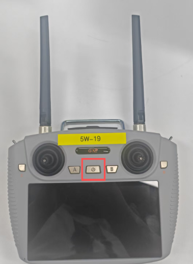
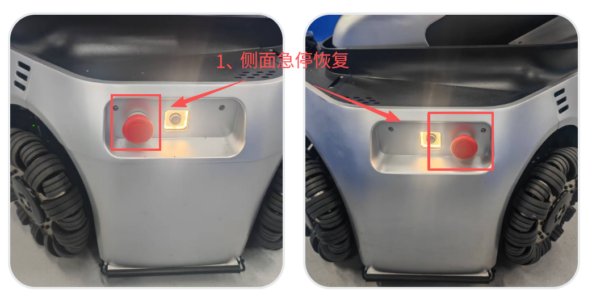
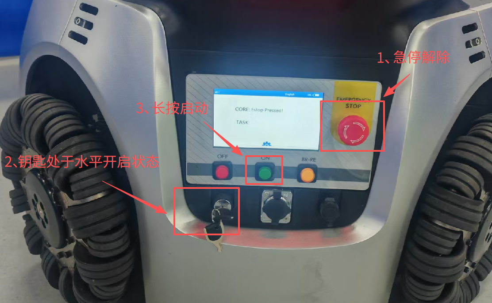
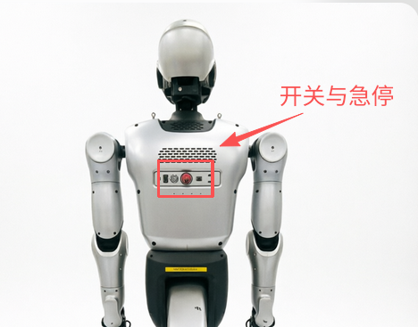
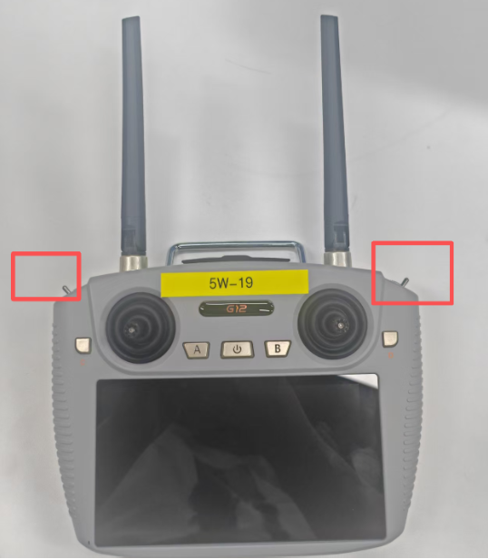
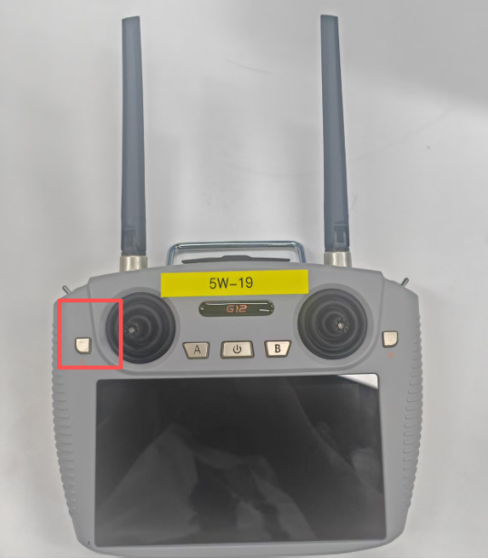
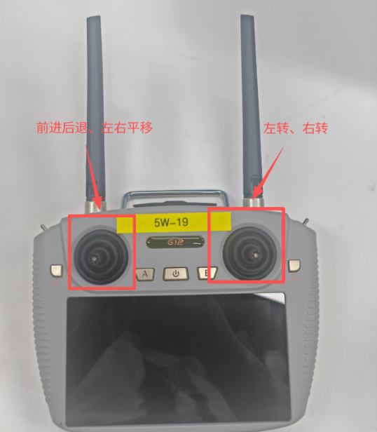
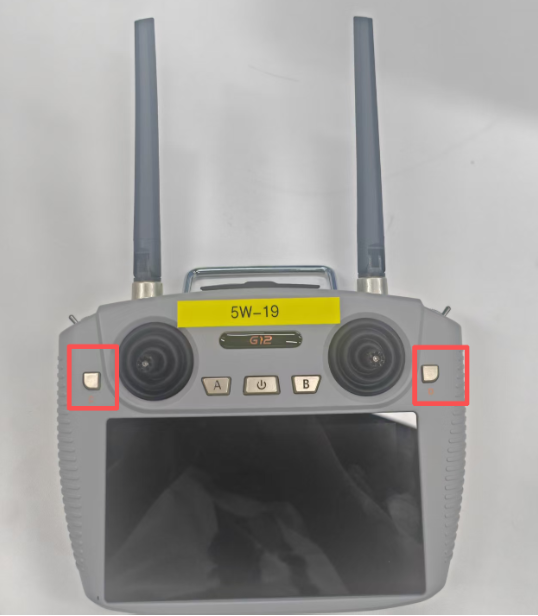
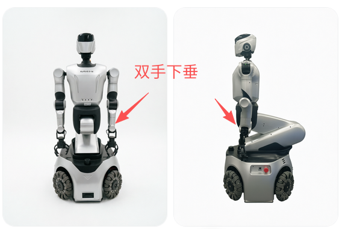

## Kuavo 5-W G12手柄操作

### 1. G12遥控器开机

长按开机键，机器人出场已经对频完成，开机之后自动连接机器人。



### 2. 机器人底盘控制

1、首先将机器人底盘三个急停恢复，然后将底盘钥匙拨到开启位置，最后长按启动按键将底盘开机，如图所示：





2、将机器人上半身急停恢复，开关启动，如图所示：



3、将G12手柄上方的左边拨杆拨到最左边，右边的拨杆拨到最右边，如图所示：



4、按一下C键



5、当机器人手臂抬起，继续按下C键。

6、现在就可以用手柄摇杆进行底盘的控制



7、如果发现底盘不动，上半身轻微晃动，需要重新启动底盘服务，在下位机中进行如下操作：

   新建终端，使用 SSH 登录底盘主机（密码：`133233`）

```bash

ssh -oKexAlgorithms=+diffie-hellman-group14-sha1 \

    -oHostKeyAlgorithms=+ssh-rsa \

    -oCiphers=+aes128-cbc,3des-cbc \

ucore@192.168.26.22

```

```bash

sudo systemctl restart urobot.service

```

### 3. 机器人关闭控制

1、将G12手柄上方的左边拨杆拨到最左边，右边的拨杆拨到最右边，如图所示：


2、同时长按C加D键，机器人双臂放下，表明关闭控制成功。




