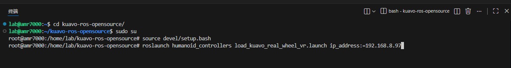
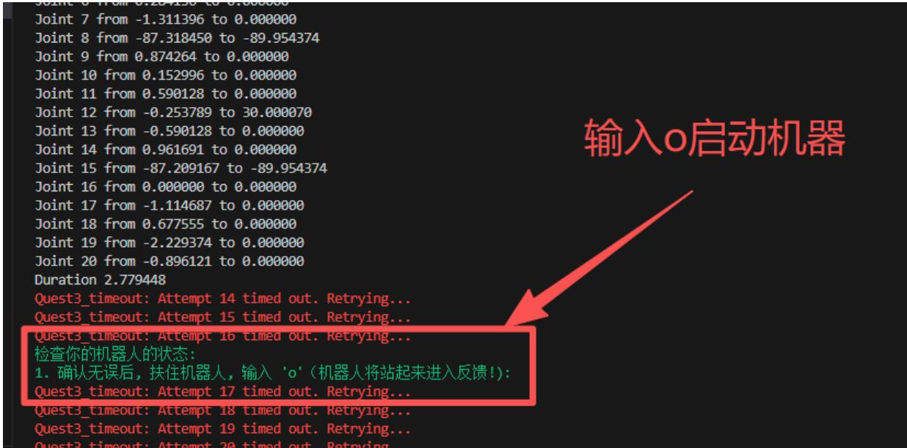
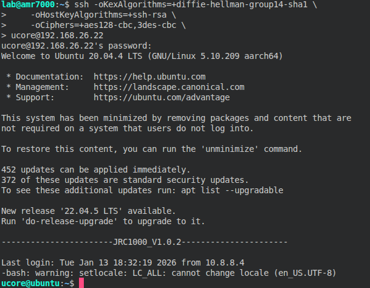

# Kuavo 5-W VR操作

## 1. 终端启动与连接

### 1.1 以 VR 模式启动机器人

1.  新建终端，进入 `kuavo-ros-opensource/` 目录。
2.  执行以下指令启动机器人 VR 模式（需要 root 权限）：

    ```bash
    cd kuavo-ros-opensource/
    sudo su
    source devel/setup.bash
    roslaunch humanoid_controllers load_kuavo_real_wheel_vr.launch ip_address:=192.168.8.97  # 替换为当前使用的 VR 设备 IP
    ```

    

### 1.2 启动机器

-   在上一步的终端中，输入 `o` 并回车，启动机器。

    

### 1.3 连接底盘主机并重启服务

1.  新建终端，使用 SSH 登录底盘主机（密码：`133233`）：

    ```bash
    ssh -oKexAlgorithms=+diffie-hellman-group14-sha1 \
        -oHostKeyAlgorithms=+ssh-rsa \
        -oCiphers=+aes128-cbc,3des-cbc \
    ucore@192.168.26.22
    ```

    

2.  启动服务指令：

    ```bash
    sudo systemctl restart urobot.service
    ```

    

### 1.4 连接 VR 并进入控制

1.  头戴 VR 设备，将 VR 设备连接到**机器人所连接的 WiFi**。
2.  打开 VR 程序，此时 VR 眼镜提示长按 `meta` 按钮，并且机器人头部会根据操作者头部同步移动，说明 VR 已成功连接机器人。

## 2. VR 手柄控制说明

### 2.1 手部控制（灵巧手）

-   **手指张合**：按**前扳机**控制手指张合。
-   **拇指开合**：触摸 `X` / `A` 键控制拇指开合。

### 2.2 腰部控制

-   **开启方法**：
    - 轻触摸X和Y键+按下B 键(注意不是重按X和Y键)，此时下肢会同步人体动作。
-   **关闭方法**：
    - 轻触摸X和Y键+按下B 键(注意不是重按X和Y键)，此时下肢会复位到初始状态。
> **注意**：开启腰部控制后请缓慢移动身体，以避免发生机器人快速运动导致异常损坏。

### 2.3 手臂解锁/锁定与复位

-   **解锁手臂**：同时按`X + A`键，再按左右上扳机，再按X和A键解锁手臂。
-   **复位并锁定手臂**：再次同时按下 `X + A`，此时手臂恢复到初始状态并锁定。
-   后续如需再次解锁，重复按下 `X + A` 即可。

### 2.4 固定手臂位置

-   **固定**：同时按下 `X + B` 此时会固定手臂。
-   **解锁**：再次按 `X + B` 此时会解锁手臂。

### 2.5 移动控制

-   **前进/后退**：向前/后推**左手柄拨杆**。
-   **左转/右转**：向左/右推**右手柄拨杆**。
  
### 2.5 程序关闭

-   同时按下 `X + Y` 键，此时机器人启动程序关闭


## 3. 操控流程演示

演示视频: [VR遥操视频]( https://www.bilibili.com/video/BV1cEokB8E1W/?share_source=copy_web&vd_source=c1e7f8baf3e616b3ad247c806fd1c221 "VR遥操视频")

