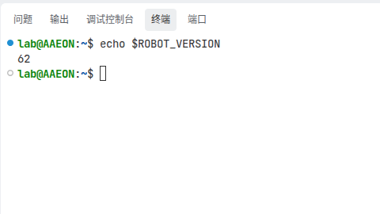
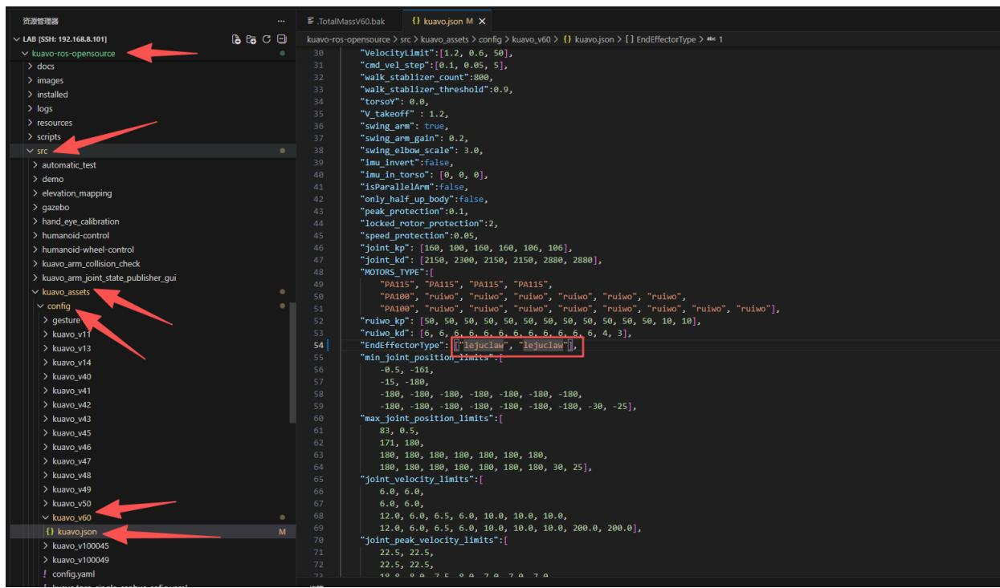
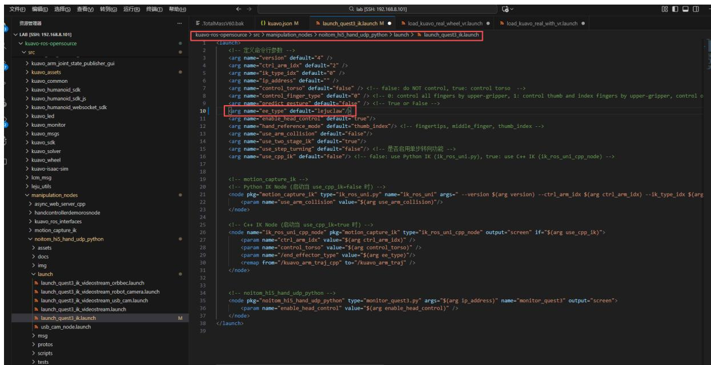
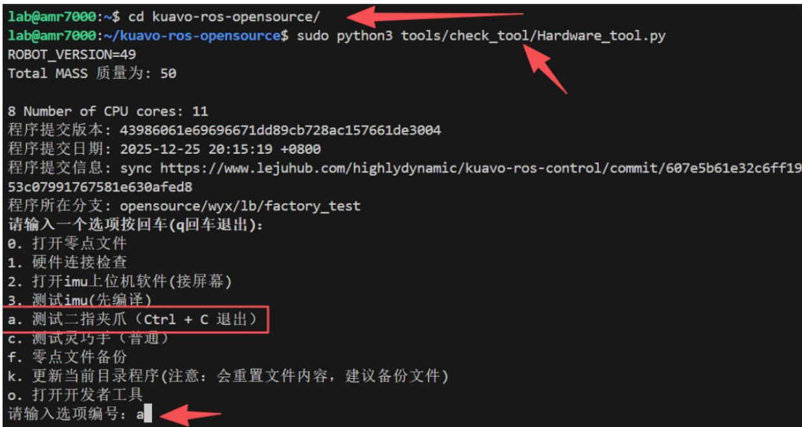
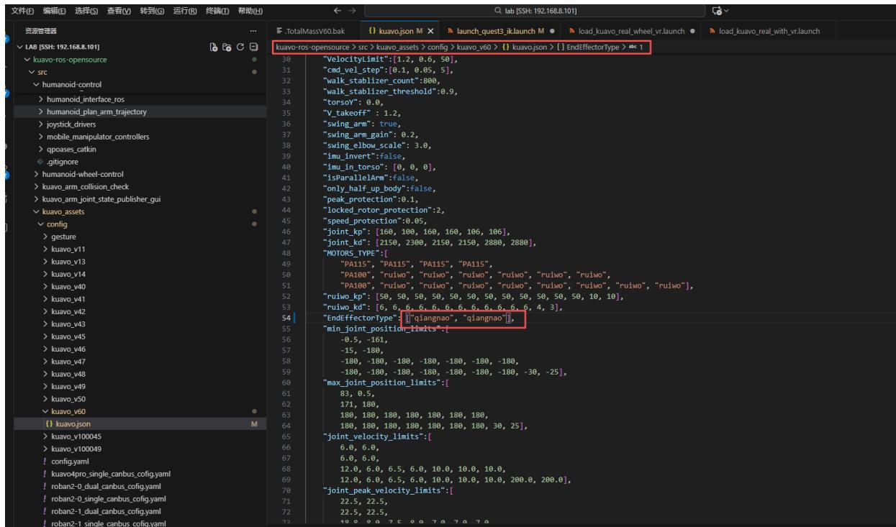

# Kuavo 5-W 启动前准备
## 硬件检查清单

1.NUC镜像烧录完成

2.电机安装完成

3.上下位机拓展口正常

4.轮臂底盘上的按键均能使用
## 相关配置

- 检查机器人版本方法，新建终端，执行以下命令：
  

```
echo $ROBOT_VERSION
```


### 1.配置喇叭（选配）

1、下位机打开终端，配置udev规则，配置完成后重启机器：

```batch
cd ~/kuavo-ros-opensource/src/kuavo_wheel 
sudo ./audio-udev-new.sh
```


2、下位机接屏幕，进入设置中的音频项，测试喇叭是否有声音


### 2.配置自研二指爪

1、修改 src/kuavo_assets/config/kuavo_v$ROBOT_VERSION/kuavo.json 配置文件中大约第54行的EndEffectorType 参数为 `lejuclaw` 

```javascript
"EndEffectorType": ["lejuclaw", "lejuclaw"],
```

下图为ROBOT_VERSION = 60版本的修改示例图，修改后ctrl+s保存，如下图：




2、修改kuavo-ros-opensource/src/manipulation_nodes/noitom_hi5_hand.udp_python/launch/launch_quest3_ik.launch 
Launch文件中的第10行



```
#原代码
<arg name="ee_type" default="qiangnao"/>
#修改为
<arg name="ee_type" default="lejuclaw"/>
```

3、修改kuavo-ros-opensource/src/humanoid_control/humanoid_controllers/launch/load_kuavo_real_wheel_vr.launch 文件中的第8行

```
#原代码
<arg name="ee_type" default="qiangnao"/>
#修改为
<arg name="ee_type" default="lejuclaw"/>
```


4、测试二指夹爪，新建终端，执行以下命令：

```shell
cd kuavo-ros-opensource/  
sudo python3 tools/check_tool/Hardware_tool.py
```

选择a，测试二指夹爪，如下图：



### 3、配置灵巧手

1、修改src/kuavo_assets/config/kuavo_v$ROBOT_VERSION/kuavo.json配置文件中大约第54行的EndEffectorType参数

```javascript
"EndEffectorType": ["qiangnao", "qiangnao"],
```

下图为ROBOT_VERSION = 60版本的修改示例图，修改后ctrl+s保存，如下图：



2、修改与上文配置二指夹爪的相同文件

 - 将kuavo-ros-opensource/src/manipulation_nodes/noitom_hi5_hand.udp_python/launch/launch_quest3_ik.launch 
Launch文件中的第10行

```
#修改为
<arg name="ee_type" default="qiangnao"/>
```
 - 将kuavo-ros-opensource/src/humanoid_control/humanoid_controllers/launch/load_kuavo_real_wheel_vr.launch 文件中的第8行
  
  ```   
#修改为
<arg name="ee_type" default="qiangnao"/>
```

3、测试灵巧手

 - 新建终端

```batch
cd ~/kuavo-ros-opensource/tools/check_tool 
sudo python3 Hardware_tool.py
```

输入字母o加回车展开开发工具栏

输入相应按键进行灵巧手的配置和测试

输入b加回车配置灵巧手usbudev规则

输入 c 加回车 测试灵巧手(如果没反应，需要重启 NUC 使得 udev 规则生效)

输入 j 加回车 测试触觉灵巧手、输入 1 配置usb，输入 2 测试触觉灵巧手正不正常(如果没反应，需要重启 NUC 使得 udev 规则生效)


