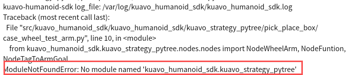
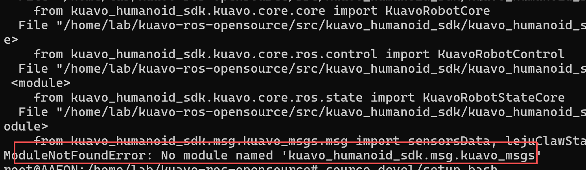

# sdk 与 msgs 常见问题

## 问题描述
 在使用pytree案例时，我们有可能会遇到msgs包找不到与sdk安装的相关的问题，如下图所示。






## 解决方案
1、安装kuavo-humanoid-sdk
```bash
cd ~/kuavo-ros-opensource 

sudo su

cd src/kuavo_humanoid_sdk

chmod +x install.sh

./install.sh
```

2、编译kuavo_msgs
```bash
cd ~/kuavo-ros-opensource 

sudo su

ccatkin config -DCMAKE_ASM_COMPILER=/usr/bin/as -DCMAKE_BUILD_TYPE=Release

source installed/setup.bash

catkin build kuavo_msgs

```

3、source 整个环境
```bash
cd ~/kuavo-ros-opensource 

source devel/setup.bash
```
