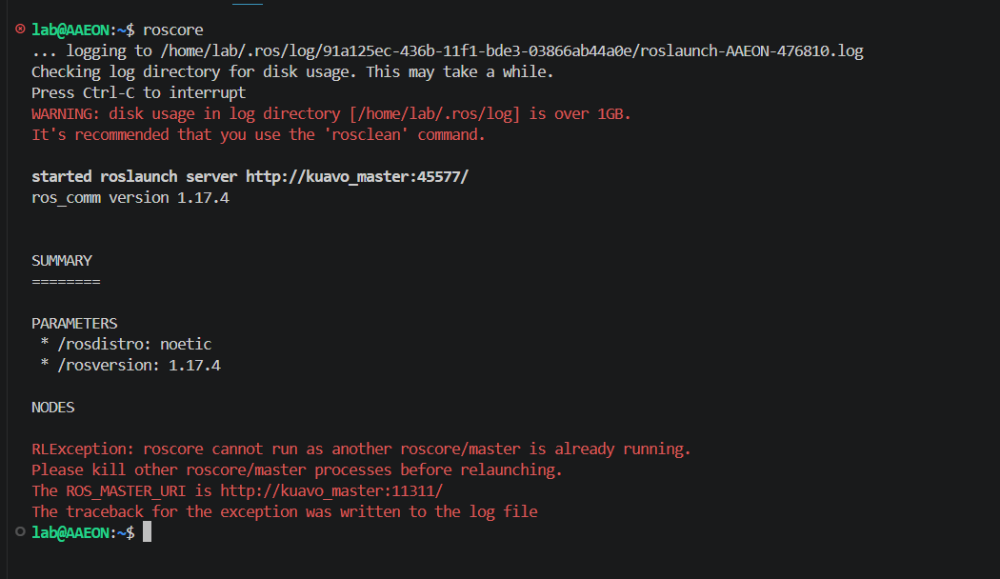
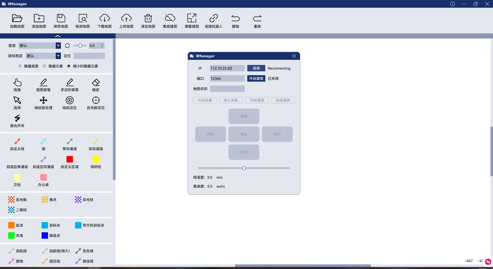
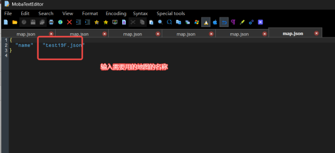
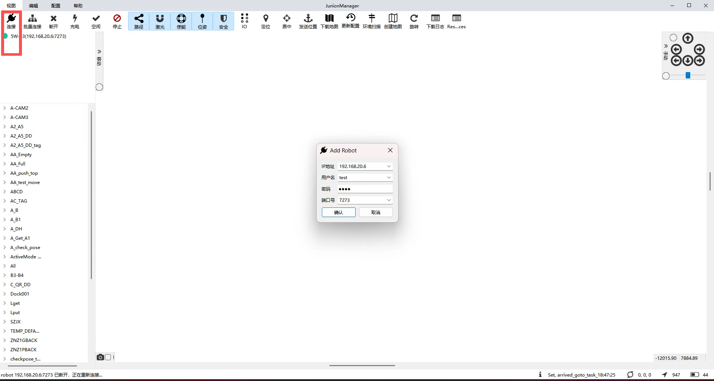
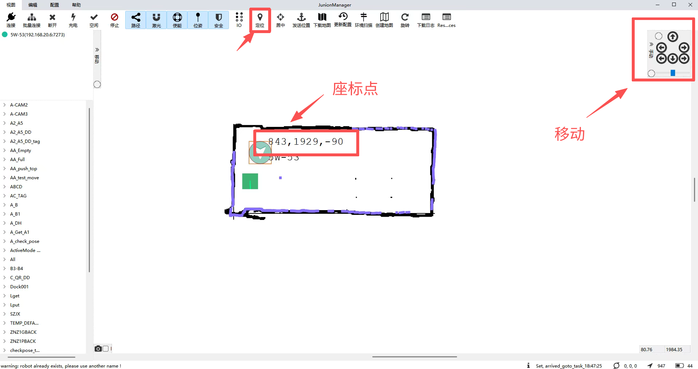

# Kuavo 5-W 轮臂机器人基础使用

## 说明

为方便使用，轮臂机器人上肢半身的控制接口与全身上肢接口完全一致，可以适配所有上肢相关案例，配置方式具体可参考[上肢控制模式](https://kuavo.lejurobot.com/beta_manual/basic_usage/kuavo-ros-control/docs/3调试教程/上肢控制模式/)中**实物运行-轮臂机器人**篇章，上肢控制接口详见[接口使用文档](https://kuavo.lejurobot.com/beta_manual/basic_usage/kuavo-ros-control/docs/4开发接口/接口使用文档/)，下面主要说明底盘的控制使用以及二次开发接口

## 软件使用

1. `Xmanger`

- 功能：本工具适用于  xManager 地图编辑工具的操作。本手册指导用户完成地图管理、地图编辑、离线建图、在线建图等操作。
 - `使用手册`位置: `kuavo-ros-opensource/docs/5功能案例/五代案例/轮臂案例/xManager用户手册.pdf`

2. `JunionManager`

- 功能：本工具适用于  JunionManager 点位校准和遥控的操作。

3. 软件获取与注意事项
- 以上软件非网络开源，安装包获取请联系我司相关工作人员。
- 软件获取后需联系我司相关工作人员更新license，才能使用软件。

## 开发接口

- 目前与底盘的通信主要采用WebSocket的通讯方式，包括请求（Request）与订阅（Subscribe）两种方式。

### 1. 订阅 (Subscribe)

- 概述
订阅机制允许客户端接收底盘系统推送的消息，如状态更新、事件通知等。客户端通过建立WebSocket连接并发送订阅请求，底盘系统将根据请求的内容推送相应的消息。

- WebSocket连接
- **连接建立**：客户端使用WebSocket协议连接到底盘服务器的特定端点。
- **心跳机制**：为保持连接活性，客户端与服务器之间定期交换心跳消息。

- 订阅请求格式
```json
{
  "type": "subscribe",
  "body": {
    "topics": ["topic1", "topic2"]
  }
}
```
- **type**：标识请求类型，订阅请求为`subscribe`。
- **body**：
  - **topics**：一个字符串数组，表示客户端想要订阅的主题列表。

- 订阅响应格式
```json
{
  "type": "notification",
  "body": {
    "topic": "topic1",
    "message": {
      // 根据topic不同，消息内容会有所差异
    }
  }
}
```
- **type**：标识响应类型，通知为`notification`。
- **body**：
  - **topic**：与订阅请求中的主题对应，标识消息所属的主题。
  - **message**：具体的消息内容，格式依据主题而定。

- 支持的订阅主题
以下是目前支持的订阅主题及其简要说明：

1. **状态更新** (`status_update`)：订阅底盘的状态更新，如电池电量、位置信息等。
2. **错误日志** (`error_log`)：接收底盘系统产生的错误日志。
3. **事件通知** (`event_notification`)：底盘系统发生特定事件时的通知，如充电完成、进入故障状态等。

- 示例：订阅状态更新
```json
{
  "type": "subscribe",
  "body": {
    "topics": ["status_update"]
  }
}
```
响应示例：
```json
{
  "type": "notification",
  "body": {
    "topic": "status_update",
    "message": {
      "battery_level": 75,
      "position": {
        "x": 10.5,
        "y": -3.2
      }
    }
  }
}
```
### 2. 请求 (Request)

- 概述
请求机制允许客户端向底盘系统发送指令或请求，以控制机器人的行为或查询状态。客户端通过建立WebSocket连接并发送请求消息，底盘系统处理这些请求并返回相应的响应。

- 请求消息格式
```json
{
  "type": "request",
  "body": {
    "action": "get_status",
    "params": {}
  }
}
```
- **type**：标识请求类型，普通请求为`request`。
- **body**：
  - **action**：字符串，表示请求的动作或意图，如`get_status`、`start_move`等。
  - **params**：一个对象，包含执行动作所需的参数。

- 响应消息格式
```json
{
  "type": "response",
  "body": {
    "status": "success",
    "data": {
      // 根据请求的动作，数据内容会有所不同
    },
    "error": null
  }
}
```
- **type**：标识响应类型，响应为`response`。
- **body**：
  - **status**：表示处理结果的状态，如`success`或`error`。
  - **data**：请求成功时返回的数据。
  - **error**：请求失败时的错误信息。

- 支持的请求动作
以下是目前支持的请求动作及其简要说明：

1. **获取状态** (`get_status`)：请求底盘的当前状态，如电池电量、位置等。
2. **启动移动** (`start_move`)：指令底盘开始移动到指定位置。
3. **停止移动** (`stop_move`)：指令底盘停止当前的移动。
4. **充电** (`start_charge`)：指令底盘前往充电站进行充电。

- 示例：请求获取状态
```json
{
  "type": "request",
  "body": {
    "action": "get_status",
    "params": {}
  }
}
```
响应示例：
```json
{
  "type": "response",
  "body": {
    "status": "success",
    "data": {
      "battery_level": 85,
      "position": {
        "x": 5.0,
        "y": 2.3
      }
    },
    "error": null
  }
}
```

# 建图使用方法  

## 连接底盘  

在机器人下位机终端，通过 `ssh` 连接到底盘终端（密码：`133233`）。

```bash
    ssh -oKexAlgorithms=+diffie-hellman-group14-sha1 \
        -oHostKeyAlgorithms=+ssh-rsa \
        -oCiphers=+aes128-cbc,3des-cbc \
    ucore@192.168.26.22
```

### 无线连接  

机器人下位机 `ssh` 的方式连接到底盘终端后，通过下方命令给底盘连接无线网络。

```bash
sudo nmcli device wifi connect "your_wifi_name" password "your_password"
```

连接成功后需修改 `/etc/netplan/01-network-manager-all.yaml` 解除无线网卡的IP锁定  

```bash
# Let NetworkManager manage all devices on this system
network:
 ethernets:
    wlan0:
      dhcp4: true
      dhcp6: true
      #addresses: [172.10.24.200/22]
      #gateway4: 172.10.24.254
      #nameservers:
      #  addresses: [192.168.0.1,61.177.7.1,8.8.8.8]
 ethernets:
    eth0:
      dhcp4: no
      dhcp6: no
      addresses: [10.8.8.8/24]
      addresses: [192.168.26.22/24]
 version: 2
```

 ## 创建地图  

### 启动下位机 roscore

 创建地图需启动 `roscore`，需要在下位机开启 `roscore`  
 登陆下位机新建终端输入下方代码，若提示未启动成功，则证明 `roscore` 已启动，正在运行，请忽略错误提示执行下一步。
 ```bash
    roscore
```
  

在底盘终端输入下方代码，启动底盘服务（密码：`133233`）

```bash
    sudo systemctl restart urobot.service
```


### 启动建图与初始化
1.启动 `roscore` 后打开 `xManager` 建图软件，点击 `离线建图` 输入 底盘IP 地址并输入地图名称后点击 `连接` 按钮  

2.待右侧状态栏显示 `connected` 后点击下方的 `开始建图`   

3.端口：默认12345，不需要修改

4.点击下方的 `开始采集` 即可控制底盘进行扫图  

  

- 注意：点击后需等待20秒，等待建图服务启动完成。可通过Mobaxterm或终端输入`top`查看底盘工控机CPU状态，启动结束后，系统CPU资源减少。特别注意不要在CPU资源很高，即建图服务正在启动的时候执行后面的操作。没有等待建图服务正常启动就执行后面的操作，会出现别的问题

5.待扫图结束后，先点击 `停止采集`，随后点击 `开始建图` ，右侧的状态栏此时会显示 `start build map` 

6.待状态栏显示 `build map success` 后即可点击 `结束建图` 按钮，此时创建好的地图会显示在软件中，可通过左侧的工具栏对地图进行修改

7.使用任意一种方式连接底盘，回到底盘文件根目录，打开`usr/local/urobot/params/map`文件夹，打开`map.json`文件 ，输入想要的地图名称完成切换地图切换。
  

8.打开`JunionManager`软件，点击上方连接按钮，输入机器人的IP地址，其余参数默认即可，点击确认连接。

  

9.连接成功后，即可看到刚才创建的地图(显示地7步填写的地图)，点击定位手动将机器人的点云与地图匹配。此时完成初始化。右侧可手动控制机器人移动，机器人会显示当前坐标点。地图创建完成。

  
