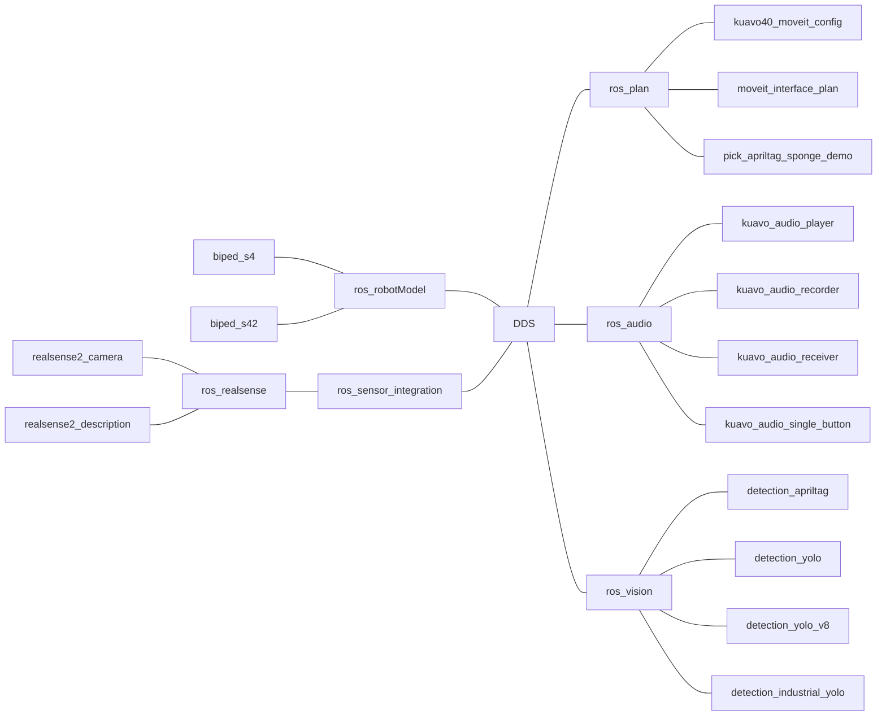

# kuavo_ros_application

## 基础信息


  - 上位机如果是i7，对应的：
    - 用户名：kuavo
    - 密码：leju_kuavo
    - Ubuntu 版本：22.04

  - 上位机如果是AGX或NX，对应的：
    - 用户名：leju_kuavo
    - 密码：leju_kuavo
    - Ubuntu 版本：20.04

## 基础环境功能包讲解

* ros_audio: 音频功能集合，提供音频播放、录制、采集和按键交互等功能。
```markdown
kuavo_audio_player        -- 音频播放功能包，包含流式播放节点（订阅audio_data话题播放PCM数据）和音乐文件服务节点（通过FFmpeg转码后发布播放）
kuavo_audio_recorder      -- 音频录制与交互功能包，提供麦克风录音、语音活动检测、音频文件播放，以及基于讯飞WebSocket API的文本转语音功能
kuavo_audio_receiver      -- USB麦克风音频采集功能包，自动识别指定USB麦克风设备，采集PCM数据并降采样至16kHz后发布到/microphone_data话题
kuavo_audio_single_button -- USB单按键设备监听功能包，通过HID接口监听指定USB设备(4132:2107)的按键事件，识别快速点击/正常按键/长按并发布到ROS话题
```

* ros_sensor_integration: 通用传感器基础节点数据流集合。
```markdown
ros_realsense
* realsense2_camera      -- Intel RealSense D400系列及T265追踪模块的ROS驱动，发布深度图、彩色图、红外图、IMU等多种传感器数据流
* realsense2_description -- Intel RealSense D400系列相机的URDF模型描述，用于RViz中展示相机3D模型和传感器坐标系
```

* ros_robotModel: 机器人模型集合，用于存放Kuavo机器人的urdf及mesh碰撞体，可用于规划仿真或者导航仿真。
```markdown
biped_s4  -- Kuavo4代机器人的URDF模型、碰撞体网格和launch配置，支持Gazebo仿真和RViz可视化
biped_s42 -- Kuavo4.2代机器人的URDF模型（含Drake版本）、碰撞体网格和launch配置，支持Gazebo仿真和RViz可视化
```

* ros_vision: 视觉功能集合，提供基于AprilTag和YOLO的目标检测与坐标转换功能。
```markdown
detection_apriltag
* apriltag_ros      -- AprilTag 3视觉基准标记检测，提供标记位姿的ROS话题发布及tf变换
* ar_control        -- 将AprilTag检测位姿从相机坐标系转换到base_link和odom坐标系并发布
* detection_show    -- 订阅AprilTag检测结果和相机图像，通过相机内参将标签3D位姿投影到图像平面，绘制绿色边框和标签ID后发布到/tag_detections_image话题

detection_yolo
* kuavo_vision_object -- 基于YOLOv5分割模型的目标检测，整合RealSense深度相机将2D检测结果转换为3D坐标，支持从相机坐标系变换到机器人躯干坐标系
* kuavo_yolo_point2d  -- 将YOLO的2D检测框或分割掩码投影到3D点云中，提取对应的目标点云子集并发布

detection_yolo_v8
* 基于YOLOv8模型的目标检测，整合RGB-D相机通过深度图计算目标3D坐标，并通过TF框架变换到base_link坐标系

detection_industrial_yolo
* yolo_box_object_detection    -- 基于YOLO模型的纸箱检测，融合RGB和深度图像进行3D定位并发布TF变换
* yolo_button_object_detection -- 基于YOLO分割模型的工业按钮检测，融合RGB和深度图像进行3D定位并发布TF变换
* yolo_valve_object_detection  -- 基于YOLO分割模型的工业阀门检测，融合RGB和深度图像进行3D定位并发布TF变换
```

* ros_plan: 机器人手臂规划集合，用于通过接收外部的poseStamped，对机器人的抓取姿态进行轨迹规划。
```markdown
kuavo40_moveit_config
* 基于biped_s4模型的MoveIt配置包，包含KDL运动学求解器、多种规划算法（OMPL/CHOMP/Pilz）、轨迹执行控制器和RViz可视化配置

moveit_interface_plan
* 基于MoveIt封装的机器人手臂轨迹规划与执行框架，包含规划器、执行器、优化器、校准器、场景管理等模块
* 支持关节空间(joint)规划和笛卡尔空间逆运动学(pose)规划，可用于抓取和放置操作

pick_apriltag_sponge_demo
* 通过相机检测AprilTag识别海绵块位姿，结合MoveIt规划右手臂轨迹实现自动抓取的完整演示案例，包含校准工具和质量检测脚本
```

- [pick_apriltag_sponge_demo 使用说明文档](src/ros_plan/pick_apriltag_sponge_demo/README.md)
- [pick_apriltag_sponge_demo 快速开始文档](src/ros_plan/pick_apriltag_sponge_demo/docs/快速开始.md)

## 快速构建 & 快速启动
### (1) clone & build your workspace
```bash
git clone https://gitee.com/leju-robot/kuavo_ros_application.git  
cd ~/kuavo_ros_application
# 拉取开源仓库时默认为master分支
source /opt/ros/noetic/setup.bash

# 安装依赖
chmod +x ./src/kuavo_speech_synthesis/install.sh
sudo ./src/kuavo_speech_synthesis/install.sh
sudo apt-get install portaudio19-dev python3-pyaudio
pip install pyyaml pygame SpeechRecognition websocket-client pyserial argparse

# 构建雷达导航功能包
./src/kuavo_slam_ws/build_kuavo_slam_ws.sh

catkin build apriltag_ros  # 优先编译apriltag_ros
catkin build               # 编译所有功能包
```
### (2) Launch启动传感器感知节点 

**需要根据实际机器人版本选择启动参数**

- 启动示例:

```bash
cd ~/kuavo_ros_application
source /opt/ros/noetic/setup.bash
source ~/kuavo_ros_application/devel/setup.bash 
# 旧版4代, 4Pro
roslaunch dynamic_biped load_robot_head.launch use_orbbec:=false
# 标准版, 进阶版, 展厅版, 展厅算力版
roslaunch dynamic_biped load_robot_head.launch use_orbbec:=true
# Max版
roslaunch dynamic_biped load_robot_head.launch use_orbbec:=true enable_wrist_camera:=true
# 五代（无手腕相机）
roslaunch dynamic_biped kuavo5_sensor_robot_enable.launch
# 五代（左右手腕相机）
roslaunch dynamic_biped kuavo5_sensor_robot_enable.launch enable_wrist_camera:=true
```

- 参数说明:(true为是, false为否)
  - use_orbbec 是否是奥比中光相机
  - all_enable 启动相机时是否连接TF树并启用二维码检测功能
  - enable_wrist_camera 是否使用手腕相机

**若相机启动时存在env相关报错,可能是因为未配置序列号,可参考[相机序列号配置说明](https://gitee.com/leju-robot/kuavo_ros_application/tree/dev/tools/camera_tools)进行配置**

### (3) 启动 websocket 服务

在启动机器人站起来后，运行：

```bash
cd ~/kuavo_ros_application
source /opt/ros/noetic/setup.bash
catkin build kuavo_msgs
source ~/kuavo_ros_application/devel/setup.bash 
roslaunch rosbridge_server rosbridge_websocket.launch port:=9090
```

然后可以使用 kuavo_humanoid_sdk 的 websocket 模式通过 9090 端口远程控制机器人。


### (4) 根据个人对于上位机的使用需求，启动不同的demo的launch文件，具体可查看docs/How_to_use_demo的上位机案例

## 环境配置

* 原始镜像如果不包含 ssh 服务的话则无法远程登录，需要安装 ssh 服务

可以使用下面的命令查看 ssh 服务是否已经安装

```bash
dpkg -l | grep openssh-server
```

如果系统已经安装了 ssh 服务，将会显示与 openssh-server 相关的信息。

```bash
kuavo@kuavo-NUC12WSKi7:~$ dpkg -l | grep openssh-server
ii  openssh-server                             1:8.9p1-3ubuntu0.5                  amd64        secure shell (SSH) server, for secure access from remote machines
```

如果没有显示任何输出或者输出中没有 openssh-server 相关的信息，则表示 SSH 服务尚未安装，可以通过下面的命令进行安装

```bash
sudo apt update
sudo apt install openssh-server
```

安装成功后可以通过 ssh 命令远程登录到系统中

* 从 Ubuntu 18.04 开始，net-tools（包含 ifconfig、netstat 等命令）不再是默认安装的软件包，而是被 iproute2 取代

如果想要使用 ifconfig 等命令需要执行下列命令进行安装

```bash
sudo apt install net-tools
```

使用 iproute2 中的 ip 命令查询当前的 ip 地址等信息

```bash
ip addr show
```

## 启动所有相机

1. 确保完成环境安装以及编译

2. 确保所有相机连接正常

3. 配置 realsense camera serial number

    ```bash
    cd <kuavo_ros_application>
    source devel/setup.bash
    rosrun kuavo_camera scan_realsence.py 
    ```

    执行完后，会输出

    ```bash
    Device 0: 230322272727
    Device 1: 427622272165
    LEFT_WRIST_CAMERA_SERIAL_NO=230322272727
    RIGHT_WRIST_CAMERA_SERIAL_NO=427622272165
    ✅ Environment variables written to ~/.bashrc
    Please restart your terminal or run 'source ~/.bashrc' to apply the changes.
    Done.
    ```
    如果左右相机序列号相反可以手动修改`~/.bashrc`文件

4. 启动所有相机，打开一个新的终端，执行以下命令：
    ```bash
    cd <kuavo_ros_application>
    source devel/setup.bash
    export DISPLAY=:2.0
    roslaunch kuavo_camera cameras.launch
    ```

    参数说明：

    - `has_head`：是否有头部相机(默认有, 类型为 **奥比中光**)
    - `has_left_wrist`：是否有左手腕相机(默认有， 类型为 **Realsense**)
    - `has_right_wrist`：是否有右手腕相机(默认有， 类型为 **Realsense**)
    - `rviz`：是否启动rviz(默认开启)

5. 打开 VNC 查看 Rviz 输出

    上位机VNC地址为: IP:5902

## SLAM 系统

[SLAM 系统使用说明](src/kuavo_slam_ws/README.md)