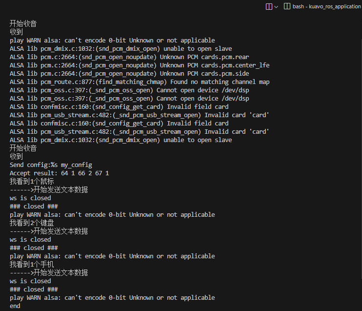
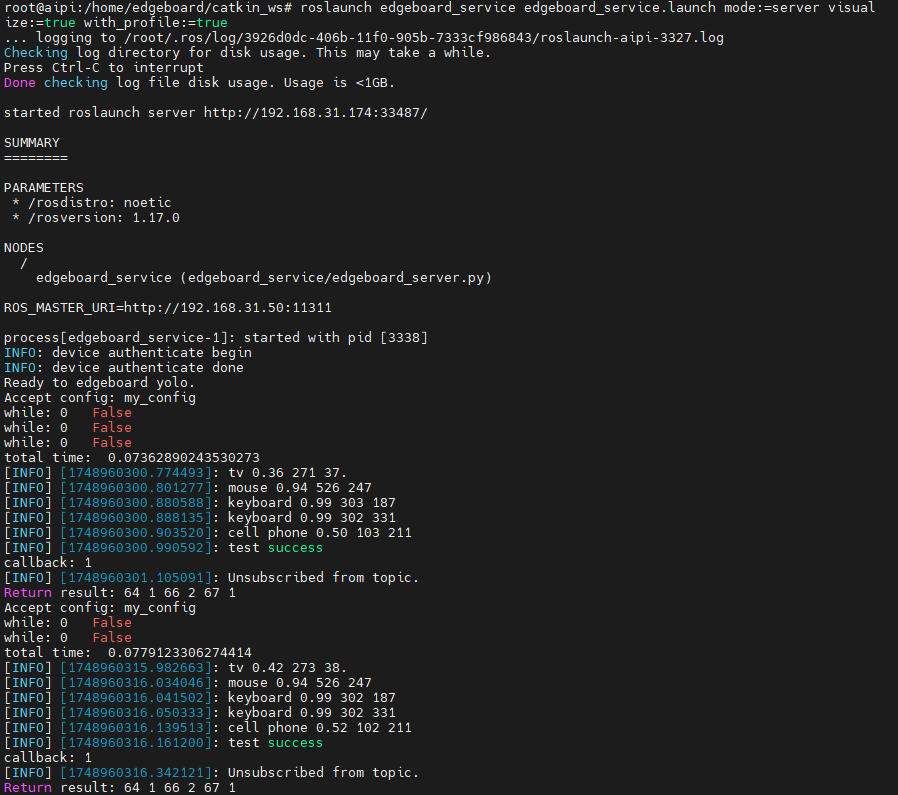
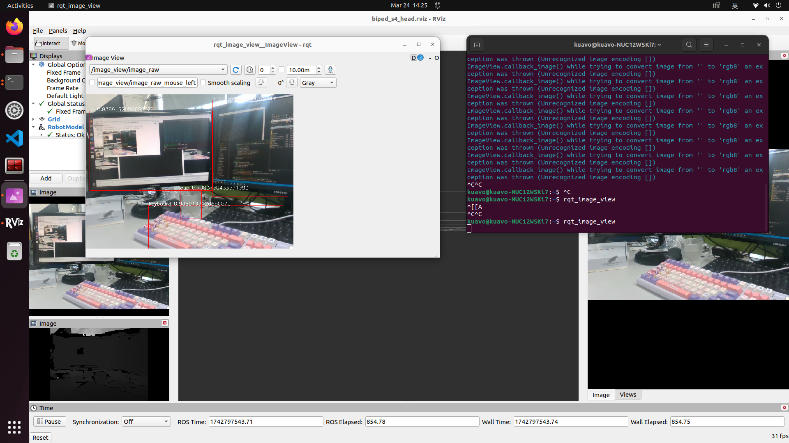

# 一、项目说明
使用百度EdgeBoard板（DK-1A）部署yolov3模型用于目标检测任务，将结果发送给机器如上位机，机器如上位机进行语音播报
注1：这里使用上位机外接扬声器进行播报
注2：上位机需要通过两次语音触发请求

# 二、项目结构
``` bash
edgeboard_service  # 自定义的服务通信功能包
├─ launch
│  └─ edgeboard_service.launch   # 根据参数启动不同的服务
├─ scripts
│  ├─ eb_test_client.py  # 客户端测试
│  ├─ eb_test_server.py  # 服务端测试
│  ├─ tts_ws_python3_demo.py  #科大讯飞模型调用案例
│  └─ upper_client.py    # 客户端处理和语音播报 上位机执行此代码
├─ srv
│  └─ EbMessage.srv  # 服务消息
└─ yolov3-python  # yolo模型部署
  ├─ model  # 模型文件
  ├─ tools
  │  └─ edgeboard_server.py   # 百度板服务端代码
  ├─ vis.jpg  # 测试输出结果图片
  └─ yolo  # 模型调用及分析
```

# 三、重要文件说明
* edgeboard_service/scripts/upper_client.py
  1. 初始化客户端，发送请求
  2. 收到处理结果，分析结果，调用科大讯飞模型进行语音播报
* edgeboard_service/yolov3-python/tools/edgeboard_server.py
  1. 初始化服务端，监听请求
  2. 收到请求后，订阅图像话题，进行处理，将处理结果通过服务通信返回
  3. 上位机可以通过rqt_image_view查看这个图像信息
  4. 取消订阅图像话题，恢复监听状态，等待下一次请求
  - 特点：仅在收到请求后进行一次图像处理，可以减少百度板的功耗，节省网络占用等


# 四、代码编译
* 上位机：
  - 编译代码：
  - - cd ~/kuavo_ros_application
  - - source /opt/ros/noetic/setup.bash
  - - catkin build

* 百度板：
  - 编译此功能包：
  - - catkin build edgeboard_service
  - 配置模型环境：
  - - 参考`kuavo_ros_application/src/edgeboard_service/yolov3-python/README.md`配置模型部署环境

# 五、launch启动文件参数说明
- `mode`：选择启动哪一个文件
  - `mode:=server`:百度板启动服务，程序仅在收到上位机请求后会订阅话题，处理完图像并返回信息后，将会关闭话题订阅，以此降低能耗
  - `mode:=client`:上位机初始化客户端，发送以此请求，并收到返回信息后进行语音播报
- `visualize`: 是否可视化
  - 若设置则会在百度板的显示器上显示图像处理结果，且在该路径下生成vis.jpg渲染结果
  - 默认为false
- `with_profile`: 是否终端显示模型推理耗时等信息，默认不显示
# 六、运行示例
  - 确保上位机与百度板局域网通信正常
  - 如果使用下位机作为ros主机，需启动一个launch或直接在`sudo su`下`roscore`
* 百度板：
- 进入对应路径
  - `cd kuavo_ros_application`
- 启动服务端：
  - `roslaunch edgeboard_service edgeboard_service.launch mode:=server visualize:=true with_profile:=true`
- 注意：服务会保持持续开启状态，可多次处理请求

* 上位机:
- 启动上位机程序
  - `cd kuavo_ros_application`
  - `sros1`
  - `source /opt/ros/noetic/setup.bash`
  - `source devel/setup.bash`
  - `roslaunch dynamic_biped load_robot_head.launch`
  - 注：如果以其他方式启动摄像头，需相应修改`rospy.Subscriber()`订阅的话题

- 启动服务请求
  - `cd kuavo_ros_application`
  - `source devel/setup.bash`
  - `roslaunch edgeboard_service edgeboard_service.launch mode:=client`
  - 语音输入`夸父夸父`,机器人回应`你好,我在.`
  - 语音输入`你看到了什么?`,机器人发送请求并语音播报结果

- 若执行可视化服务
  - 在新终端执行`rqt_image_view`

# 六、测试结果

* 上位机客户端终端\


* 上位机语音输出内容
  - 我看到一个鼠标
  - 我看到两个键盘
  - 我看到一个手机

* 百度板服务端终端\


* 图片处理结果示例\


* 上位机终端可视化示例\


* 百度板服务端代码流程图\
