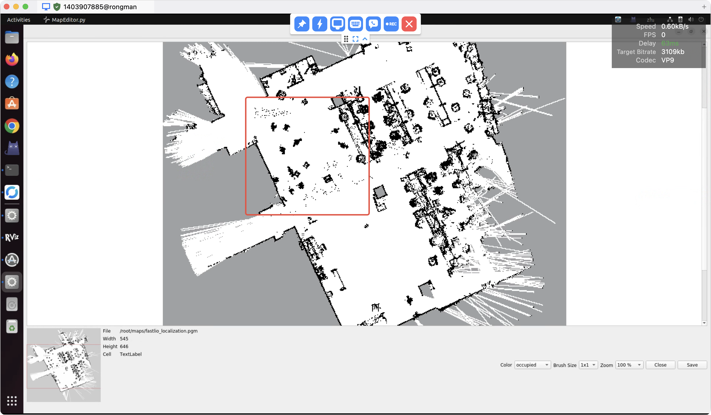
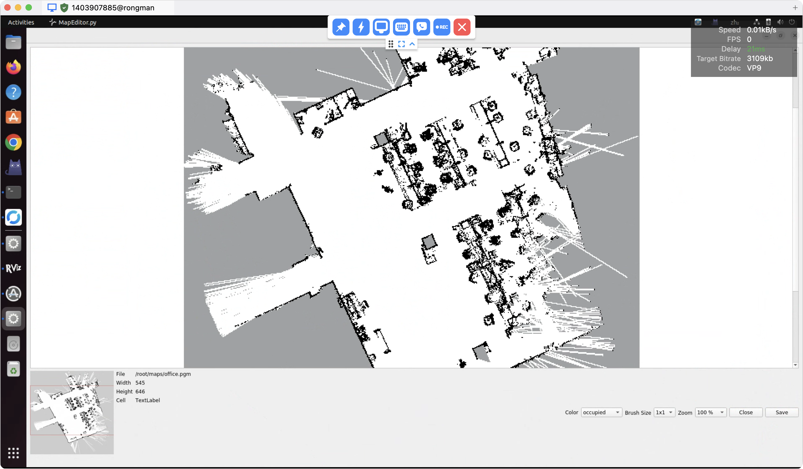

# Kuavo SLAM 工作空间

这是一个基于ROS1的SLAM（同时定位与地图构建）和导航系统

## 系统架构

该系统集成了以下主要组件：

- **Livox ros driver2** - Livox-MID360 激光雷达 ROS 驱动
- **FAST-LIO** - 激光雷达惯性里程计算法以及 3D 点云地图构建
- **Octomap Server** - 2D占用栅格地图构建
- **Move Base** - ROS导航框架
- **Map Manager** - 地图和任务点管理服务
- **Foxglove Bridge** - 可视化桥接工具

**API 文档：[API](doc/API.md)**

## 容器使用

**如果您的系统不是 Ubuntu 20 的版本，建议您在容器中使用 Kuavo SLAM.**

我们提供了一个 Dcoker 镜像包含了 Kuavo SLAM 的编译和运行环境，您可以执行如下命令进入容器:

```bash
exp1 # 如果是 VNCViewer 先执行改命令
./docker/run.sh
```

**后续的编译和启动命令都可以在容器内执行.**

## 雷达选型与配置说明：Livox Mid-360 和 Mid-360s

如果在已经使用MID360的机器人上使用MID360s 雷达时必须卸载原来的 SDK 安装M ID360s 的 SDK  
在启动雷达相关的功能时请先执行：

```bash
export LIDAR_TYPE=MID360s  #使用MID360s 激光雷达
export LIDAR_TYPE=MID360   #使用MID360 激光雷达
```

也可以直接配置在 ~/.bashrc 文件中配置

```bash
echo 'export LIDAR_TYPE=MID360s' # 使用MID360s激光雷达
echo 'export LIDAR_TYPE=MID360'  # 使用MID360激光雷达
```

## 快速开始

### 0. 前期准备

配置好上位机的静态 ip 以及雷达的 ip ，参考文档[雷达配置](LivoxViewer2/readme.md)

进入镜像后，编译代码：
```bash
./build_kuavo_slam_ws.sh
```

### 1. 构建地图

使用以下命令启动地图构建：

```bash
source devel/setup.zsh
# source devel/setup.bash # 如果是 bash 
roslaunch kuavo_mapping build_map.launch
```

#### 主要参数说明：

- `pointcloud_min_z` / `pointcloud_max_z`: 点云Z轴过滤范围（默认：-0.5 到 0.5）
- `occupancy_min_z` / `occupancy_max_z`: 占用栅格Z轴范围（默认：-0.5 到 0.5）
- `sensor_model/min_range` / `sensor_model/max_range`: 传感器有效范围（默认：0.5 到 10.0米
- `crop_box`: 是否启用点云裁剪（默认：false）
- `foxglove`: 是否启动Foxglove可视化（默认：false）

#### 启动的节点：

1. **clear_pcd.sh** - 清理之前的PCD文件
2. **livox_ros_driver2** - MID360激光雷达驱动
3. **pointcloud_to_laserscan** - 点云转激光扫描数据
4. **fast_lio** - **激光雷达惯性里程计**
5. **octomap_server** - 2D地图构建服务器

#### 点云过滤配置

系统支持点云裁剪过滤（CropBox），用于过滤掉不需要的点云数据，提高建图质量和系统性能。配置文件位于 `kuavo_mapping/config/mid360_filter.yaml`：

```yaml
# CropBox Configuration for FAST-LIO
crop_box:
  enable: true              # 启用点云裁剪过滤
  negative: true            # 负向过滤（保留框外数据，过滤框内数据）
  
  # 定义边界框（世界坐标系，单位：米）
  # 当前配置：机器人周围1.5米范围内的点云
  min_x: 1.5                # X轴最小值
  max_x: -1.5               # X轴最大值
  min_y: -1.5               # Y轴最小值  
  max_y: 1.5                # Y轴最大值
  min_z: -0.05              # Z轴最小值（地面高度）
  max_z: 0.05               # Z轴最大值（高度限制）
```

**配置说明**：

- **enable**: 启用或禁用点云裁剪功能
- **negative**: 过滤模式
  - `true`: 负向过滤，过滤边界框内的点云，保留框外的点云
  - `false`: 正向过滤，保留边界框内的点云，过滤框外的点云
- **坐标范围**: 在世界坐标系（odom frame）中定义边界框
- **单位**: 所有坐标值单位为米

#### 建图注意事项

**建图时，机器人的雷达一定要水平与地面，如果倾斜，会导致点云数据方向不是水平地面，会将地面的点云数据当成障碍物，导致建图失败**

**建议将机器人头部电机摆好后，机器人程序进入 cali_arm 模式，头部电机使能(使能后不会乱晃），然后进行建图**

**环境要求**：
- **人员位置**：建图时用户应站在机器人身后，避免遮挡激光雷达视野
- **动态物体**：确保环境中没有动态物体（如人、车、动物等）
- **静态环境**：建图期间环境应保持相对静止

**影响说明**：
- **3D地图噪点**：动态物体会在3D点云地图中产生噪点，影响全局定位精度
- **2D地图异常**：动态物体会在2D栅格地图中产生不应该出现的占用栅格，影响路径规划
- **定位精度**：环境中的动态干扰会降低SLAM算法的定位精度

**建议**：
- 选择人流量较少的时间进行建图
- 建图前清理环境中的临时障碍物
- 建图过程中保持环境稳定
- 如果必须有人在场，确保人员远离激光雷达扫描范围


### 2. 保存地图

地图构建完成后，运行保存脚本：

```bash
source devel/setup.zsh
# source devel/setup.bash # 如果是 bash
rosrun kuavo_mapping save_map.sh
```

该脚本会：

- 保存2D栅格地图和3D点云地图到 `~/maps/` 目录
- 使用时间戳命名文件

### 3. 地图编辑

系统集成了基于PyQt5的地图编辑器，用于对生成的2D栅格地图进行后处理和优化。

#### 启动地图编辑器

```bash
cd <kuavo_ros_application>/src/kuavo_slam_ws/src/ros_map_editor
python MapEditor.py ~/maps/map_YYYY-MM-DD_HH-MM-SS
```

#### 编辑器功能

**1. 基本操作**
- **缩放控制**：支持100%、200%、400%、800%、1600%五种缩放级别
- **实时预览**：底部缩略图显示当前视口位置
- **文件信息**：显示地图文件名、尺寸、分辨率等信息

**2. 编辑模式**
- **Occupied（占用）**：将区域标记为障碍物（黑色），机器人不能通过
- **Unoccupied（空闲）**：将区域标记为可通行区域（白色），机器人可以安全通过

**3. 笔触大小**
- **1x1**：单像素编辑，适合精细调整
- **3x3**：3x3像素区域编辑，适合小范围修改
- **5x5**：5x5像素区域编辑，适合中等范围修改
- **7x7**：7x7像素区域编辑，适合大范围修改
- **9x9**：9x9像素区域编辑，适合大面积修改

**4. 编辑方法**
- **点击编辑**：单击地图上的任意位置进行编辑
- **拖拽编辑**：按住左键拖拽进行连续编辑
- **实时更新**：编辑后立即更新显示和数据

#### 编辑应用场景

**1. 地图清理**
- 删除传感器误检测的障碍物
- 清理建图过程中动态物体产生的噪点
- 修正SLAM算法产生的错误占用区域

**2. 禁区标记**
- 标记机器人不能进入的区域（如池塘、花坛、危险区域等）
- 设置虚拟边界和限制区域
- 定义机器人活动范围

**3. 路径优化**
- 清理影响路径规划的异常占用区域
- 优化狭窄通道的通行性
- 调整关键节点的可通行性

#### 保存编辑结果

编辑完成后，点击 **Save** 按钮保存修改：

- 编辑器会显示保存成功或失败的提示
- 修改会直接保存到原始PGM文件
- 建议在编辑前备份原始地图文件

#### 编辑注意事项

**1. 数据一致性**
- 编辑器直接修改PGM文件，确保与ROS导航系统兼容
- 修改后的地图可以立即用于导航系统
- 建议在编辑前停止导航系统，避免数据冲突

**2. 编辑精度**
- 根据地图分辨率选择合适的笔触大小
- 高分辨率地图建议使用较小的笔触进行精细编辑
- 低分辨率地图可以使用较大的笔触进行快速编辑

**3. 备份建议**
- 编辑前备份原始地图文件
- 记录重要的编辑操作，便于后续维护
- 定期保存编辑进度，避免数据丢失

### 图片示例

**✍️ 编辑前**



**✍️ 编辑后**



### 4. 启用导航系统

#### 启动导航系统

```bash
source devel/setup.zsh
# source devel/setup.bash # 如果是 bash 
roslaunch kuavo_navigation kuavo_navigation.launch map:=map_YYYY-MM-DD_HH-MM-SS
```

#### 主要参数说明：

- `base_local_planner`: 局部路径规划器（dwa_local_planner 或 mpc_local_planner, 默认位为 mpc_local_planner）
- `map`: 地图文件路径
- `foxglove`: 是否启动 Foxglove 桥接（默认：false）
- `odom_source`: 里程计来源（默认：lidar）
  - `robot`: 使用机器人里程计
  - `lidar`: 使用激光雷达里程计
- `crop_box`: 是否启用点云裁剪（默认：false）


- **odom_source:=robot**: 使用 机器人 IMU 的状态估计里程计，并且使用 `base_link` 作为机器人基座坐标系
- **odom_source:=lidar**: 使用 激光雷达里程计，并且使用 `lio_base_link` 作为机器人基座坐标系


#### 启动的节点：

1. **move_base** - 导航核心节点
2. **global_localization** - 全局定位节点
3. **load_map** - 地图加载
4. **map_manager** - 地图和任务点管理服务

#### 全局定位

导航系统启动后，需要进行全局定位以确定机器人在地图中的位置：

**方法1：使用RViz进行定位**

1. 启动RViz：`rviz`
2. 添加Map、PointCloud2和PoseWithCovarianceStamped显示
3. 点击 **2D Pose Estimate** 按钮，在地图上设置机器人初始位置和朝向

**方法2：使用Foxglove进行定位**

1. 在Foxglove Studio中连接ROS1 Bridge
2. 添加地图和点云显示
3. 使用位姿估计工具设置初始位置

**方法3：基于任务点的定位**
使用 `/initialpose_with_taskpoint` 话题，通过任务点名称进行定位：

- 系统会根据任务点名称查找对应的任务点位置
- 自动将任务点位置转发到 `/initialpose` 话题进行全局定位
- 适用于已知任务点位置的快速定位

```bash
# 通过任务点名称进行定位（只需要传任务点名称）
rostopic pub /initialpose_with_taskpoint std_msgs/String "data: 'task1'"
```

#### 导航控制方法

1. **使用RViz发送导航目标**：
   - 在RViz中点击 **2D Nav Goal** 按钮
   - 在地图上点击目标位置并拖拽设置朝向

2. **使用Foxglove发送导航目标**：
   - 在Foxglove Studio中使用导航目标工具
   - 设置目标位置和朝向

3. **使用服务调用导航到任务点**：
   ```bash
   rosservice call /navigate_to_task_point "task_name: 'task1'"
   ```


#### Map Manager 服务接口

导航系统集成了Map Manager，提供以下服务接口：

**1. 地图管理服务**

- **load_map** (`kuavo_mapping/LoadMap`)
  - 输入：`string map_name` - 地图名称
  - 输出：`bool success` - 加载成功状态，`string message` - 状态信息

- **get_current_map** (`kuavo_mapping/GetCurrentMap`)
  - 输入：空
  - 输出：`string current_map` - 当前加载的地图名称

- **get_all_maps** (`kuavo_mapping/GetAllMaps`)
  - 输入：空
  - 输出：`string[] maps` - 所有可用地图名称列表

**2. 任务点管理服务**

- **task_point** (`kuavo_mapping/TaskPointOperation`)
  - 操作类型常量：
    - `ADD=0` - 添加任务点
    - `UPDATE=1` - 更新任务点
    - `DELETE=2` - 删除任务点
    - `GET=3` - 获取所有任务点
  - 输入：
    - `int8 operation` - 操作类型
    - `kuavo_mapping/TaskPoint task_point` - 任务点位姿信息
    - `string name` - 任务点名称
    - `bool use_robot_current_pose` - 是否使用机器人当前位置
  - 输出：
    - `bool success` - 操作成功状态
    - `string message` - 状态信息
    - `kuavo_mapping/TaskPoint[] task_points` - 任务点列表（GET操作时返回）

- **navigate_to_task_point** (`kuavo_mapping/NavigateToTaskPoint`)
  - 输入：`string task_name` - 任务点名称
  - 输出：`bool success` - 导航启动状态，`string message` - 状态信息

任务点会发布 `/task_points_markers` 话题，便于可视化。

### 5. 数据回放与分析

kuavo_navigation 集成了rosbag的录制和回放功能，在导航过程中，会自动录制导航数据到 `~/maps/` 目录下，并生成一个 `.bag` 文件。

#### 回放导航数据

使用系统提供的回放启动文件进行数据回放：

```bash
roslaunch kuavo_navigation replay_navigation.launch bag_file:=20250703_060014.bag
```

#### 回放参数说明

- `bag_file`: rosbag文件名（位于 `~/maps/` 目录下）

#### 回放功能特性

1. **时间同步**: 自动发布时钟信息，确保所有节点使用统一的时间基准
2. **可视化**: 集成RViz显示，支持地图、点云、轨迹等可视化
3. **播放控制**: 支持暂停、继续、速度调节等播放控制
4. **数据完整性**: 保持原始数据的完整性和时序关系

#### 回放应用场景

**1. 导航性能分析**
- 分析路径规划效果
- 评估定位精度
- 检查避障行为

**2. 问题调试**
- 重现导航异常
- 分析传感器数据
- 验证算法改进效果

**3. 系统验证**
- 验证参数调优效果
- 测试新功能
- 性能基准测试

#### 回放注意事项

1. **文件路径**: 确保rosbag文件位于 `~/maps/` 目录下
2. **资源占用**: 回放大量数据时注意系统资源使用情况
3. **数据兼容性**: 确保回放的数据与当前系统版本兼容

## 配置说明

### 传感器配置

系统针对Livox MID360激光雷达进行了优化配置：

- 点云过滤参数在 `kuavo_mapping/config/mid360_filter.yaml`
- 导航参数在 `kuavo_navigation/config/` 目录下

## 文件结构

```
kuavo_slam_ws/
├── src/
│   ├── kuavo_mapping/
│   │   ├── launch/
│   │   │   ├── build_map.launch      # 地图构建启动文件
│   │   │   └── load_map.launch       # 地图加载启动文件
│   │   ├── scripts/
│   │   │   ├── save_map.sh           # 地图保存脚本
│   │   │   └── map_manager.py        # 地图管理器
│   │   └── config/
│   │       └── mid360_filter.yaml    # 传感器过滤配置
│   ├── kuavo_navigation/
│   │   ├── launch/
│   │   │   ├── kuavo_navigation.launch  # 导航启动文件
│   │   │   └── replay_navigation.launch # 数据回放启动文件
│   │   └── config/                   # 导航配置文件
│   └── ros_map_editor/               # 地图编辑器
│       ├── MapEditor.py              # 主程序文件
│       ├── UI_MapEditor.ui           # Qt Designer UI文件
│       ├── ui_map_editor.py          # 生成的UI Python模块
│       └── README.md                 # 编辑器说明文档
└── README.md
```

## 注意事项

1. **地图保存**: 确保地图构建完成后再运行保存脚本，否则PCD文件可能不存在
2. **坐标系**: 仿真和实机模式使用不同的坐标系，请根据实际情况选择
3. **参数调优**: 根据实际环境调整点云过滤和传感器范围参数
4. **可视化**: 建议启用Foxglove进行实时可视化监控
5. **全局定位**: 导航前必须进行全局定位，确保机器人位置准确
6. **任务点管理**: 使用Map Manager服务可以方便地管理常用位置点
7. **地图编辑**: 编辑地图前建议备份原始文件，编辑时注意保持数据一致性
8. **编辑精度**: 根据地图分辨率选择合适的笔触大小，确保编辑效果

## 故障排除

### 常见问题

1. **PCD文件不存在**: 检查地图构建是否完成，等待足够时间让FAST-LIO生成点云数据
2. **导航失败**: 检查地图文件路径是否正确，确保坐标系配置正确
3. **传感器数据异常**: 检查激光雷达连接和驱动配置
4. **定位失败**: 确保全局定位已完成，检查TF变换是否正确
5. **任务点操作失败**: 检查Map Manager是否正常运行，数据库权限是否正确
6. **docker中开启节点失败**: 需要配置 `ROS_MASTER_URI`, `ROS_IP`, `ROS_HOSTNAME`
7. **docker中打开Rviz**: 给用户配置 `xhost +local:docker` 和 `echo DISPLAY=:1`
8. **雷达坐标系反转**：由于 5 代机器人在结构上反转了雷达的安装，用户需要配置 `ROBOT_VERSION`，根据不同的型号机器人来选择相对应的配置文件，从而反转雷达坐标系
