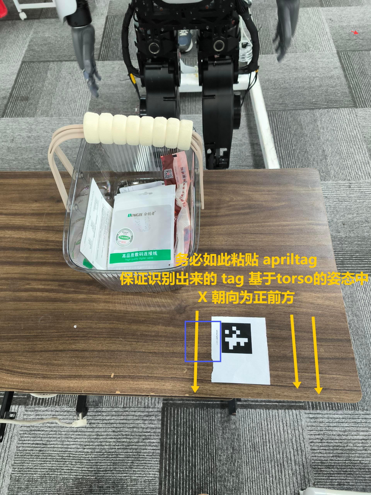
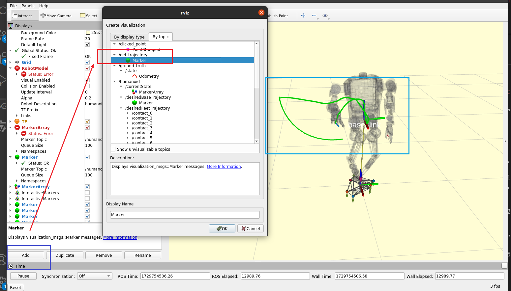
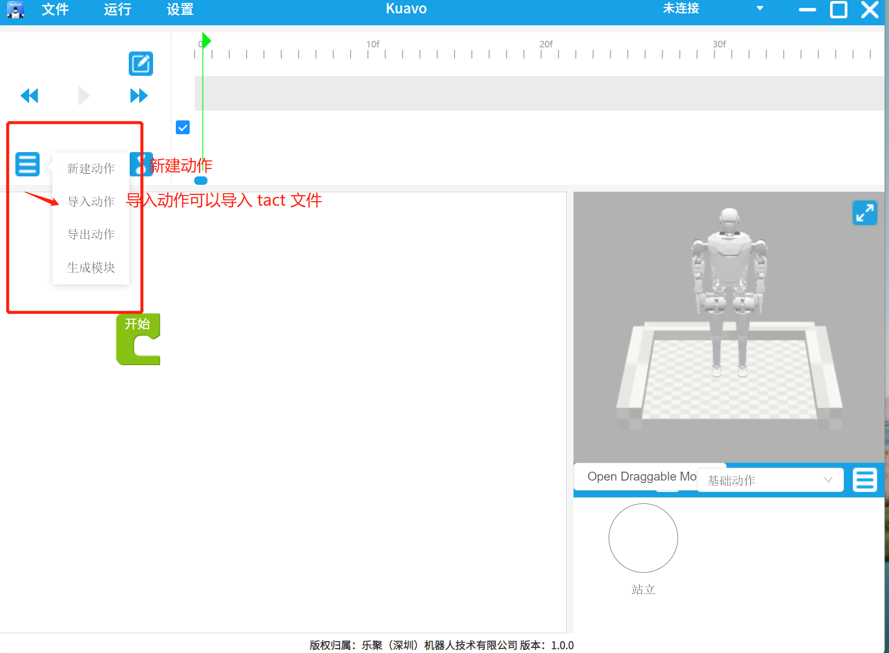
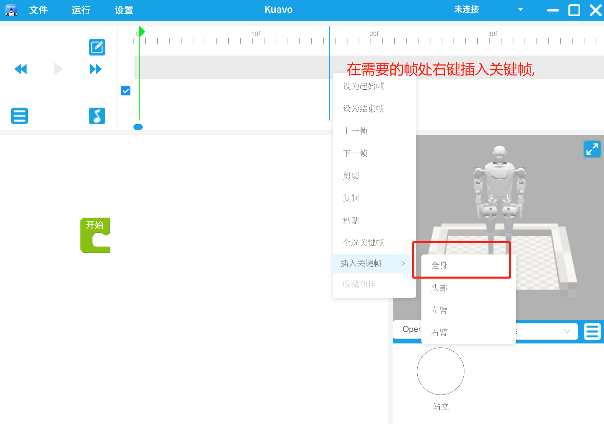
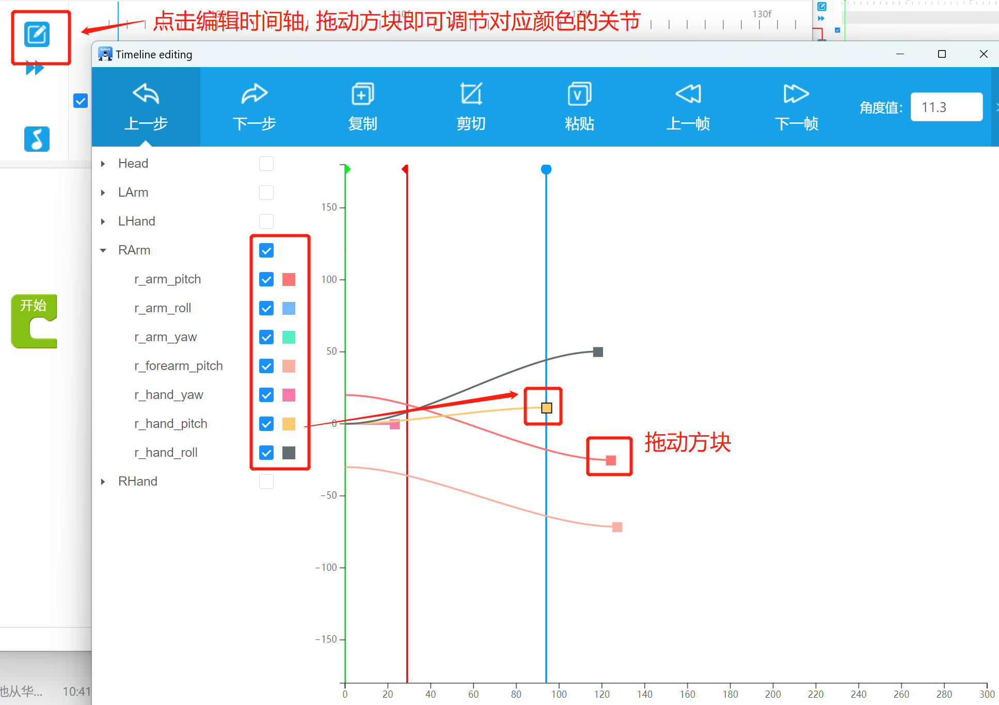

# Demo - pick/putdown basket!

> 已通过测试的 commit:
> - kuavo-ros-control: dev 分支, commit: bfa20d5c9f7d76e32aa1ba75abcd6f97dc9cccac
> - apriltag 识别功能, kuavo_ros_application 仓库 task_navigation 分支, commit: 9e1f4bb07cf22bd835289508f5c1e6c08dbfcc09
> - 本示例: kuavo_ros_application 仓库, dev 分支, commit:c8d11fde7e04942c61259909a1d65982bbded142

**重要! 重要! 重要! 摆放说明:**
- 请务必调整 apriltag 的粘贴方向, 确保在 tag 基于 torso 的 X 朝向是正前方.
- 可以在 rviz 中查看 apriltag 的姿态朝向, 确认无误后在运行程序,
- **否则, 由于机器人需要根据 tag 的姿态来调整机器的朝向, 有可能会出现原地扭转的现象, 导致崩溃运行中断.**



## 目录结构
```bash
.
├── CMakeLists.txt
├── README.md
├── config
│   └── action_files # 使用桌面软件制作的固定轨迹      
├── launch
│   ├── moveit.launch           # 启动 moveit 服务 (实际未用到)
│   └── pick_basket.launch      # 节点启动文件
├── msg     # 从 kuavo-ros-control 中拷贝过来的消息文件
├── scripts
│   ├── common                  # 公共方法
│   ├── bezier_curve_planner.py # 贝塞尔曲线轨迹规划
│   ├── control_arm.py          # 手臂控制
│   ├── control_hand.py         # 灵巧手控制
│   ├── kuavoRobotSDK.py        # kuavo sdk
│   ├── close_to_tag.py         # 单步行走靠近
│   ├── pick_basket_node.py
│   ├── pick_basket_service.py
│   ├── ros_service.py          # 节点 ROS 服务
│   ├── moveit                  # moveit 辅助调试 (实际未用到)
│   │   ├── moveit_ifk_wrap.py  # moveit 逆解/正解
│   │   ├── moveit_wrap.py      # moveit 规划
│   │   └── planner.py  
│   └── tests # 测试脚本
│       ├── mock_tag_publisher.py       # mock `/robot_tag_info` 话题发布 apriltag 数据
│       └── pick_basket_client_test.py  # 客户端调用示例
├── srv     # 从 kuavo-ros-control 中拷贝过来的服务文件
└── tools
    └── trace_end_effector_pose.py # 发 eef 的运动轨迹到 `/eef_trajectory` 方便在 rviz 中查看
```

## 依赖
```bash
sudo apt update
sudo apt install ros-noetic-apriltag-ros
```

## 编译

```bash
git clone https://www.lejuhub.com/ros-application-team/kuavo_ros_application.git
git checkout dev
catkin build ocs2_msgs dynamic_biped pick_basket apriltag_ros
```

## 启动运行

### 启动 ocs2 节点
首先需要先启动 ocs2 节点，详细操作步骤阅读请[参考文档](https://www.lejuhub.com/highlydynamic/craic_code_repo/-/blob/beta/readme.md)。

由于我们的节点依赖`humanoid_plan_arm_trajectory`手臂规划节点，因此请你在 OCS2 对应的 launch 文件中添加如下内容：

```bash
    # 在 load_normal_controller_mujoco_nodelet.launch 和 load_kuavo_real.launch 添加如下内容启动 humanoid_plan_arm_trajectory 节点
    <include file="$(find humanoid_plan_arm_trajectory)/launch/humanoid_plan_arm_trajectory.launch"/>
```

```bash
git clone https://www.lejuhub.com/highlydynamic/craic_code_repo.git
git checkout beta

sudo chmod +x <kuavo-ros-control>/ci_scripts/build.sh
./ci_scripts/build.sh

# 仿真环境运行
source devel/setup.bash # 如果使用zsh，则使用source devel/setup.zsh
roslaunch humanoid_controllers load_normal_controller_mujoco_nodelet.launch # 启动控制器、mpc、wbc、仿真器

# 实物运行
source devel/setup.bash
roslaunch humanoid_controllers load_kuavo_real.launch
```

### 启动apriltag识别节点
```bash
# 新建一个目录
mkdir -p ~/<your-path>/ && cd ~/<your-path>/
git clone https://www.lejuhub.com/ros-application-team/kuavo_ros_application.git
git checkout task_navigation
catkin buiild # 编译

source devel/setup.bash
roslaunch dynamic_biped sensor_robot_head_pub.launch
```

### 本节点启动

```bash
source devel/setup.bash
roslaunch pick_basket pick_basket.launch 
```

## 配置文件
配置文件在目录`src/pick_basket/config/config.json`下， 其中参数含义如下：
- `tag_id`: 参考的 tag id，
- `pick_pose`: rpy 即灵巧手抓取的姿态，`[-1.47520731, -0.09104861 , 2.11646936]` 为手心朝下的姿态，
- `handup_pose`: 抓取后抬手时的灵巧手姿态，
- `handup_z_offset`: 末端抬高高度，
- `xyz_offset`:  抓取点参考 tag 的偏移量（比如 tag 可能粘贴在篮子等物品旁边），
- `model_file_path`: IK 需要用到的 URDF 模型文件路径，
- `ready_action_path`:  抓取固定轨迹1，即手臂从原点运动到 ready 就绪点的动作文件，
- `handdown_action_path`: 抓取固定轨迹2,即抓取完放到旁边的动作文件，
- `handup_action_path`: 放置固定轨迹1, 即从旁边抬起物品放置的动作文件，
- `goback_action_path`: 放置固定轨迹2, 即手臂归位到原点的动作文件，
- `stand_params.expected_offset`: 站位点期望距离 tag 的偏移量， 根据 tag 的粘贴的位置与机器人站立桌前的位置调整.
- `stand_params.x_threshold`: x 的阈值，
- `stand_params.y_threshold`: y 的阈值，
- `stand_params.yaw_deg_threshold`: 机器人姿态与 tag 的偏航角差值（度数）。
- `head_orientation`: 机器人头部姿态，因为需要低头才能看到 tag, 可根据实际需求进行设置。
```json
{
    "tag_id": 0,
    "pick_pose": [-1.47520731, -0.09104861 , 2.11646936],
    "handup_pose": [-1.60520731, -0.09104861 , 2.11646936],
    "xyz_offset": [0.0, 0.0, 0.0],
    "handup_z_offset": 0.22,
    "stand_params": {
        "expected_offset": [-0.5941477310174345, -0.05, 0],
        "x_threshold": 0.05,
        "y_threshold": 0.05, 
        "yaw_deg_threshold": 10
    },
    "model_file_path": "../../ros_robotModel/biped_s3/urdf/biped_s3_arm.urdf",
    "ready_action_path": "../config/action_files/r_ready.tact",
    "goback_action_path": "../config/action_files/r_goback.tact",
    "handup_action_path": "../config/action_files/r_handup.tact",
    "handdown_action_path": "../config/action_files/r_handdown.tact"
}
```

## ROS 接口

节点名称：pick_basket_service_node

服务名称：**/pick_basket**

消息格式：
```bash
uint8 action  # 0 - 抓取, 1 - 放置
uint8 tag_id  
---
bool result   # true - 成功，false - 失败
string message
```
- action: 动作指令
- tag_id: tag 参考id

## 客户端调用示例
运行客户端调用示例脚本，机器人会缓慢靠近 tag ，然后执行抓取动作，往后退一定距离，再次靠近 tag，执行放置动作。
```bash
source devel/setup.bash
chmod +x src/pick_basket/scripts/tests/pick_basket_client_test.py
rosrun pick_basket pick_basket_client_test.py

# 或者 python3 src/pick_basket/scripts/tests/pick_basket_client_test.py
```

## 调试

### 原地抓取/放置
执行抓取和放置脚本时， 程序会在当前目录下记录下抓取和放置的四段轨迹到`pick1.tact`,`pick2.tact`,`putdown1.tact`和`putdown2.tact`文件中，方便使用 kuavo 桌面软件重播调试。
```bash
source devel/setup.bash
rosrun pick_basket pick_basket_service.py
# 或者 python3 src/pick_basket/scripts/pick_basket_service.py

# 其他测试
rosrun pick_basket kuavoRobotSDK.py
rosrun pick_basket control_arm.py
rosrun pick_basket bezier_curve_planner.py
```

### 靠近
运行单步移动靠近 tag 程序时，需要先启动 mock apriltag 程序，否则无法获取 tag 数据。
```bash
# 终端1：
python3 src/pick_basket/scripts/tests/mock_tag_publisher.py

# 终端2：
python3 src/pick_basket/scripts/close_to_tag.py
```

### 工具

#### mock apriltag 
mock 发布`/robot_tag_info`话题数据，用于测试。
```bash
python3 src/pick_basket/scripts/tests/mock_tag_publisher.py
```
#### trace eef trajectory

tf 转换 eef 的运动轨迹发布到`/eef_trajectory` 话题，方便 rviz 中查看。 
```bash
chmod +x src/pick_basket/scripts/trace_end_effector_pose.py

source devel/setup.bash
rosrun pick_basket trace_end_effector_pose.py
# 或者 python3 src/pick_basket/scripts/trace_end_effector_pose.py
```


## 实现细节 
发布话题：
- `/control_robot_hand_position`：用于末端灵巧手控制
- `kuavo_arm_traj`： 用于手臂手臂控制

订阅话题：
- `/robot_tag_info`： apriltag 数据
- `humanoid_mpc_observation`： mpc 状态， 可获取手臂关节当前位置
- `/bezier/arm_traj`： bezier 规划后发布的轨迹
- `/bezier/arm_traj_state`： bezier 规划状态，是否规划结束

服务：
- `arm_traj_change_mode`： 切换手臂控制模式， 为 2 时才可通过外部发送位置控制
- `/bezier/plan_arm_trajectory`：bezier 规划服务

**抓取动作分为两段轨迹**：
- 轨迹1：从原点到抓取点，
- 轨迹2：在抓取点完成抓取后，抬手放置到旁边，设为 holdon 点，
- 即执行轨迹1到达抓取点 ---> 抓取动作 ---> 执行轨迹 2 收手到旁边。

其中，对于轨迹1有：
 - 固定轨迹1(r_ready.tact)---> 到达 ready 点 ---> 从 ready 点分若干步逆解到抓取点，
 - 即往 r_ready.tact 文件 append 逆解得到的关键帧。
其中，对于轨迹2有：
 - 抓取点 ---> 抬手点 ---> 固定轨迹2(r_handdown.tact)
 - 固定轨迹2(r_handdown.tact) 为放置物品到 holdon 点的固定轨迹，
 - 即往 r_handdown.tact 文件 push_front 逆解得到的关键帧。

**放置动作分为两段轨迹**：
- 轨迹1：从旁边抬起物品，放到 basket 点，
- 轨迹2：松开物品后，抬手回到原点，
- 即执行轨迹1从旁边抬起物品到basket 点 ---> 松手放置 --> 执行轨迹2 回到原点。

**对于固定轨迹可以自行使用桌面软件编辑生成。**

## 其他
### 桌面软件使用
打开桌面软件如下：
- 可通过新建动作在桌面软件中新建动作文件，然后时间轴上添加关键帧，


- 点击编辑时间轴按钮，通过拖拽不同颜色的方块控制关节的位置，


### tact 文件
tact 文件即由时间轴上的数个关键帧组成的 json 动作文件，其中：
 - `servos`： 表示对应的关节值，前 14 个为手臂关节，左手与右手各 7 个关节，
 - `keyframe`: 表示对应的帧时值
 - `CP`： 为对应关节在关键帧的控制点