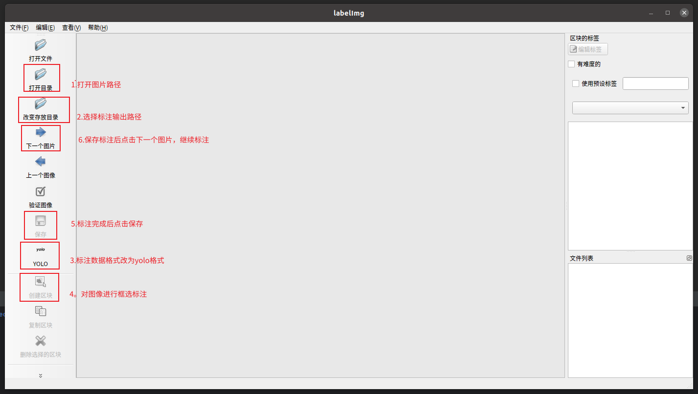

# 搬箱子案例

## 功能概述
该案例实现了机器人通过视觉识别箱子并执行抓取操作的功能。主要功能包括：
1. 使用 YOLO 模型实时检测图像中的箱子
2. 计算箱子与图像中心的偏移量
3. 根据偏移量控制机器人移动（前进/后退/转向）
4. 当机器人移动到合适位置时执行抓取动作
5. 支持键盘控制（空格键启停机器人运动）

## roban2_move_boxes 包的目录结构
```commandline
roban2_move_boxes/
├── CMakeLists.txt                  # 构建配置文件
├── package.xml                     # ROS包元信息文件
├── model                           # 模型文件（YOLO）
│   └── best.pt                     # 训练好的箱子模型权重
│   └── yolov8n.pt                  # YOLO训练好的模型权重
├── launch                          # 启动文件目录
│   └── get_boxes_image.launch      # 用于启动获取箱子图片功能的launch文件
│   └── roban_move_boxes.launch     # 用于启动move_boxes功能的launch文件
│   └── yolo_auto_annotation.launch # 用于启动自动标注功能的launch文件
├── src                             # 源码目录
│   └── scripts                     # 可执行脚本目录
│       └── generate_yolo_dataset.py# 将标注好的图像转成YOLO数据集
│       └── get_boxes_image.py      # 通过相机获取图像并保存到指定文件夹
│       └── move_boxes_demo.py      # 主程序，机器人自动移动与抓取逻辑
│       └── yolo_auto_annotation.py # 通过训练好的箱子模型对相似的箱子进行自动标注
│       └── yolo_train.py           # 使用YOLO训练模型对图像进行训练
└── README.md                       # 包说明文档
```


## 1. 主程序启动：  
```
cd ~/kuavo_ros_application
catkin build roban2_move_boxes kuavo_msgs
source devel/setup.bash
roslaunch roban_move_boxes roban_move_boxes.launch
```

注意： 使用 ssh 登录机器人，无法显示图像窗口  
1. 需要配置主从机后，在 rviz 或者 rqt 中订阅图像话题  
2. 使用 VNC 连接机器人  


## 2. 环境安装
```
pip install labelimg
pip install ultralytics
```

## 3. 模型训练
### 1. 数据采集
  - 启动脚本：```roslaunch roban2_move_boxes get_boxes_image.launch ```
  - 使用方式：按下空格键可保存图像窗口中图像到 `~/Desktop/yolo/images` 目录


### 2. 数据标注
  - 在终端运行 `labelimg`
  
  - labelimg 的使用
    1. 点击`打开目录`，选择上一步中图像保存的目录
    2. 点击`改变存放目录`，选择存放标注文件的目录
    3. 点击`YOLO`，将数据标注格式改为 `YOLO`
    4. 点击`创建区块`，在图像上对箱子进行框选打打上类别标签
    5. 标注后点击`保存`
    6. 点击`下一个图片`，切换到下一个图片
    7. 重启4-6步骤，直到所有图片都完成标注


- 数据集生成  
  终端执行 
  ```
  python3 generate_yolo_dataset.py 
    --img_dir ~/Desktop/yolo/images 
    --label_dir ~/Desktop/yolo/labels 
    --output_dir ~/Desktop/yolo/dataset 
    --split_ratio 0.8 
    --shuffle
    ```  
  设置图片所在目录 `image_directory`  
  设置标注文件所在目录 `label_directory`   
  设置输出目录`output_directory`  
  设置训练集比例 `split_ratio`  


### 3. 模型训练
  终端执行：
  ```commandline
  python3 yolo_train.py --model_path yolov8n.pt --dataset_path dataset.yaml --epochs 200
  ```
  `model_path`: 预训练模型文件的路径  
  `dataset_path`: yolo数据集的目录的路径  
  `epochs`:设置训练的轮数  

 
### 数据自动标注(可选)  
运行脚本
```
python3 yolo_auto_annotation.py --model_name best.pt --base_dir my_dataset --yolo_conf 0.6
```

1. 主要功能：  
使用`模型训练`中对部分数据训练后得到的新的模型，对新数据进行自动标注
   - 从摄像头捕获视频流，进行实时检测并显示结果
   - 可通过按键保存检测结果为图像和标注文件，用于数据集构建
   - 生成 classes.txt 文件，包含模型的所有类别名称

2. 参数说明：   
加载模型：--model_name best.pt 指定训练好的 YOLO 模型文件  
指定数据集：--base_dir my_dataset 设置包含待标注图片的目录路径  
设置置信度：--yolo_conf 0.6 只保留置信度 ≥ 0.6 的检测结果（过滤低质量预测） 

3. 使用方式：
   1. 脚本运行后，通过查看图像界面，检测结果符合预期，点击保存按键，对图像和标注信息进行保存。  
   2. 自动标注完成后，打开 `labelimg` 对数据集进行确认，查看是否存在漏标错标的数据，进行修正后保存。  
   3. 使用 `generate_yolo_dataset.py` 脚本生成 yolo 数据集。 
   4. 对生成的数据使用`yolo_train.py `进行训练。


## move_boxes_demo.py 说明文档

以下是 `roban2_move_boxes` 节点中涉及的 **ROS 话题（Topics）** 和 **服务（Services）** ：

---

## 📡 ROS 话题（Topics）

| 话题名称 | 消息类型 | 发布者/订阅者 | 功能说明 |
|-|-----------|----------------|----------|
| `/joy` | `sensor_msgs/Joy` | Publisher | 发布 Joy 控制器状态，用于控制机器人步态切换。 |
| `/key_pressed` | `std_msgs/String` | Publisher / Subscriber | 用于发布和订阅键盘按键事件（如空格键触发抓取）。 |
| `/camera/color/image_raw` | `sensor_msgs/Image` | Subscriber | 订阅原始 RGB 图像数据，用于目标检测与视觉导航。 |
| `/camera/color/image_processed` | `sensor_msgs/Image` | Publisher | 发布处理后的图像（绘制了检测框、偏移信息等）。 |
| `/robot_head_motion_data` | `kuavo_msgs/robotHeadMotionData` | Publisher | 控制机器人头部转动角度。 |
| `/cmd_pose` | `geometry_msgs/Twist` | Publisher | 控制机器人下蹲和站立动作（通过 z 方向线速度）。 |
| `/cmd_vel` | `geometry_msgs/Twist` | Publisher | 控制机器人底盘运动（线速度和角速度）。 |

---

## ⚙️ ROS 服务（Services）

| 服务名称 | 服务类型 | 调用方 | 功能说明 |
|----------|-----------|--------|----------|
| `/roban2_arm_action` | `kuavo_msgs/Roban2ArmAction` | Client (`self.grab_boxes`) | 调用机械臂执行抓取动作，返回抓取结果状态。 |

---

## ✅ 总结

### 🧠 功能逻辑
- **手动控制**：
  - 空格键切换移动模式（启动/停止）；
  - Ctrl+C 退出程序。
- **图像识别**：订阅 `/camera/color/image_raw`，使用 YOLO 检测箱子并计算其在图像中的位置。
- **自主移动**：
  - 根据箱子的偏移量调整机器人的方向和速度；
  - 当箱子靠近时减速直至停止，并准备抓取。
- **抓取流程**：
  - 停止机器人运动；
  - 下蹲；
  - 调用 `/roban2_arm_action` 抓取箱子；
  - 站起；
  - 返回

---

## 📌 注意事项

1. **依赖项检查**：
   - 确保 `/roban2_arm_action` 服务可用；
   - 确保摄像头节点已启动且 `/camera/color/image_raw` 正常发布图像；启动摄像头：`roslaunch realsense2_camera rs_camera.launch`
   - 确保 [model/best.pt]存在且路径正确。
   - 需要在上位机仓库中运行 `roslaunch roban2_move_boxes roban2_move_boxes.launch ` 启动执行搬箱子动作的程序。


2. **调试工具**：
   - 使用 `rqt_image_view` 查看 `/camera/color/image_processed`；
   - 使用 `rostopic echo /key_pressed` 监听按键事件；
   - 使用 `rviz` 查看 `/cmd_vel` 对应的运动轨迹。
---
