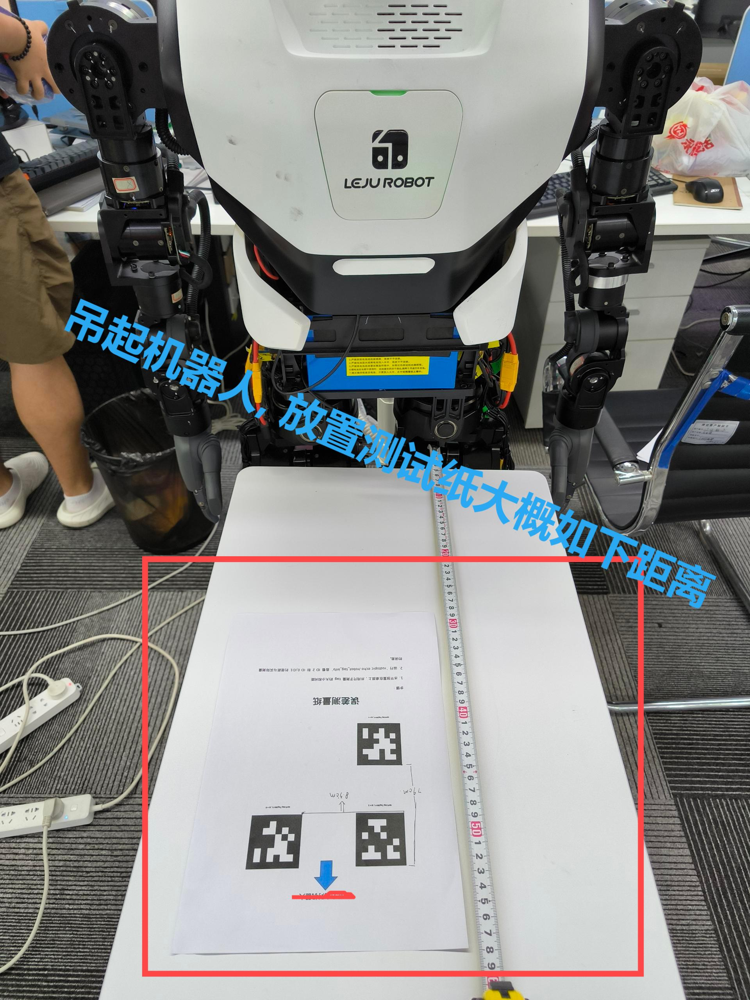
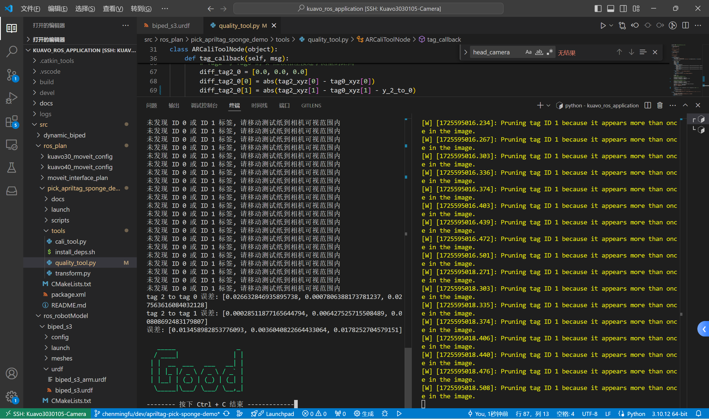
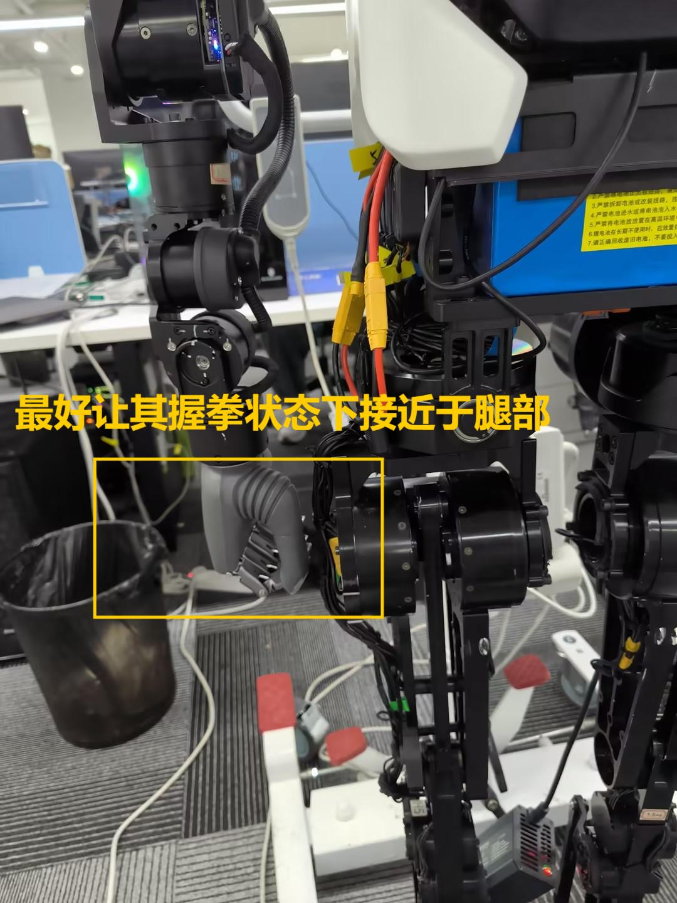
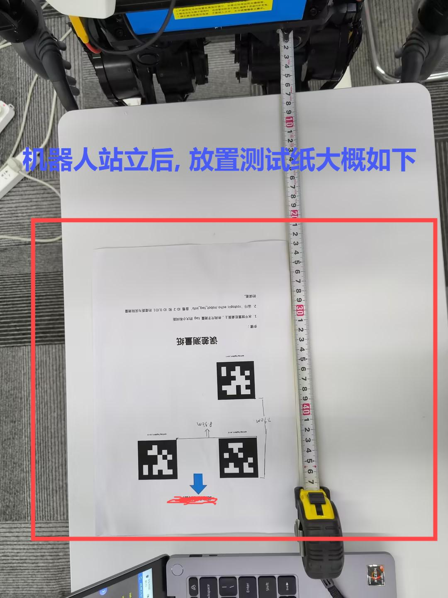
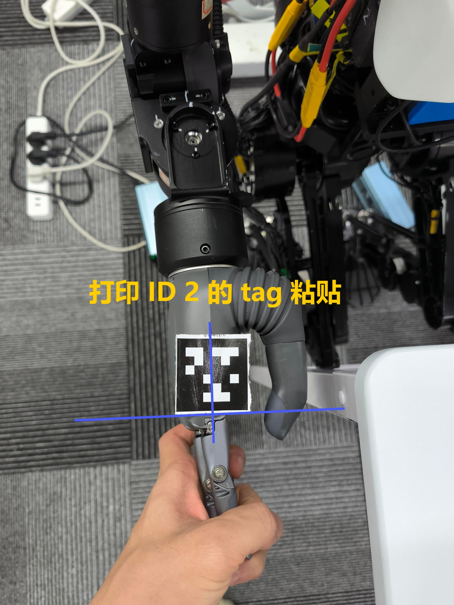
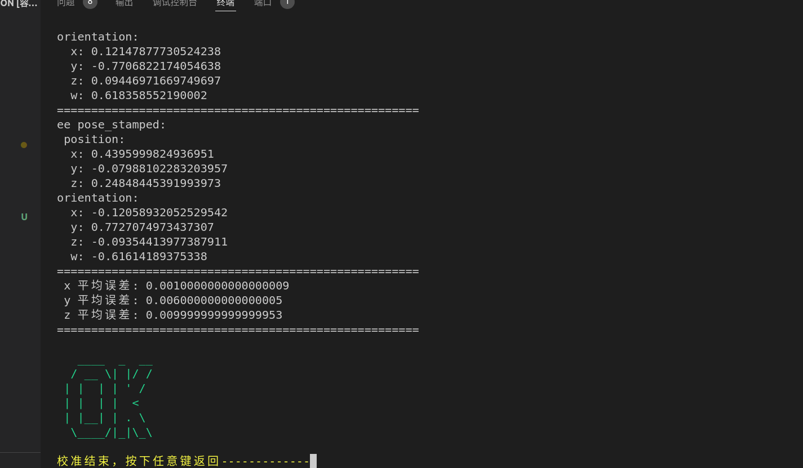
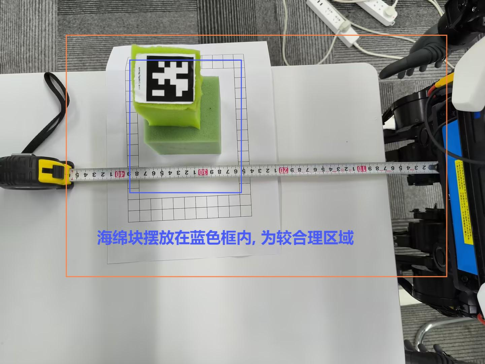
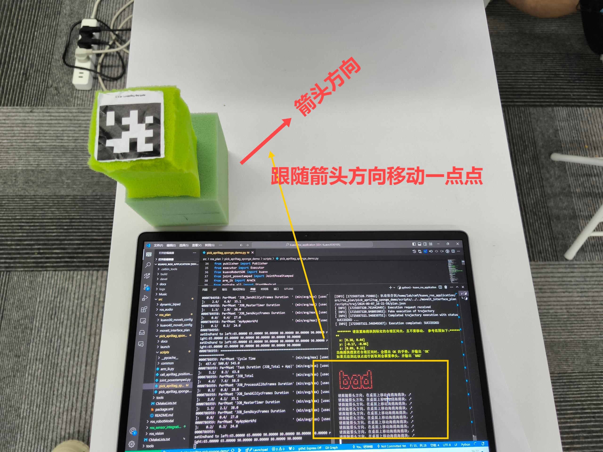
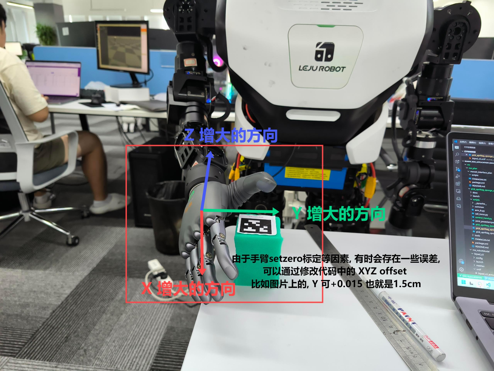

# Apriltag 海绵块抓取案例 - 右手

## 概览

- [物料准备](#物料准备)

- [预备知识](#预备知识)

- [运行环境](#运行环境说明)

- [配置说明](#配置说明)

- [运行案例](#运行案例)

- [快速

## 物料准备

本小节内容请阅读[**物料说明与标定**](./docs/物料说明与标定.md)文档，并打印目录`docs/打印材料`下`打印材料-`开头的PDF文件。**注意：打印时请务必勾选实际大小选项进行打印。**

## 预备知识

在运行案例之前，我们默认您已掌握以下知识：

- 熟悉 kuavo 实物机器人的校准、启动、控制等操作步骤

- 会使用 Linux 的基本命令

如果您不熟悉对应的步骤，可自行到对应的 [kuavo_opensource](https://www.lejuhub.com/highlydynamic/kuavo_opensource)仓库阅读[使用文档](https://www.lejuhub.com/highlydynamic/kuavo_opensource/-/blob/dev/docs/base_useage.md)。

## 目录结构

因为整个 kuavo_ros_application 集成了好几种功能包，比如音频流、视觉识别、激光雷达等。但在本案例中，我们仅关心相机视觉方面的apriltag 检测识别功能包，以下是我们主要关心的目录：

```bash
docs/ # 文档目录，包含了环境搭建、示例使用说明
src/
|-- dynamic_biped 
|-- ros_plan
    |-- kuavo30_moveit_config  # 3代机器人相关的moveit 规划控制器
    |-- kuavo40_moveit_config  # 4代机器人相关的moveit 规划控制器
    |-- moveit_interface_plan  # 封装的执行器、控制器、规划器等接口
    `-- pick_apriltag_sponge_demo # apriltag 海绵块抓取案例
|-- ros_robotModel # URDF 模型
    |-- biped_s3   # 3代头
    `-- biped_s4   # 4代头 
|-- ros_sensor_integration # realsensor 依赖包
`-- ros_vision
    |-- detection_apriltag # apriltag 检测的ROS节点
    |-- detection_yolo # 如果不关心， 可以CATKIN_IGNORE忽略
```

对于有些我们没有用到的功能包，我们可以在对应的目录下创建`CATKIN_IGNORE`文件，选择编译时忽略这些包（因为编译这些无用的包可能会报错）。

## 运行环境说明

#### 上位机

在本案例及后续行文中，上位机一概指的是头部的NUC。上位机器的环境如下：

用户名：kuavo 密码：leju_kuavo

```bash
kuavo@kuavo-NUC12WSKi7:~$ lsb_release -a
No LSB modules are available.
Distributor ID:    Ubuntu
Description:    Ubuntu 22.04.3 LTS
Release:    22.04
Codename:    jammy
```

#### 下位机

在本案例及后续行文中，下位机一概指的是躯干的NUC连接着摄像头，也就是运行 kuavo 、控制机器人本体的电脑。

用户名：lab  密码：三个空格

```bash
 lab@NUC11TNKi7:~/$ hostnamectl 
   Static hostname: NUC11TNKi7
         Icon name: computer-desktop
           Chassis: desktop
        Machine ID: 955bc2c6074f48d0a34b97d25e24c99b
           Boot ID: 469498f9c08846a3b201702324bfae95
  Operating System: Ubuntu 20.04.6 LTS
            Kernel: Linux 5.15.158-rt76
      Architecture: x86-64
```

#### 编译

以下步骤在上位机操作：

```bash
git clone https://www.lejuhub.com/ros-application-team/kuavo_ros_application.git

cd ~/kuavo_ros_application # 替换成您实际的工作目录

# 安装依赖
sudo sh src/ros_plan/pick_apriltag_sponge_demo/tools/install_deps.sh

catkin build # 编译
```

以下步骤在下位机操作：

```bash
# 编译 kuavo
mkdir -p catkin_kuavo_ws/src && cd catkin_kuavo_ws/src
git clone https://www.lejuhub.com/highlydynamic/kuavo_opensource.git
cd ../
catkin_make

# 编译本案例
cd ..
git clone https://www.lejuhub.com/ros-application-team/kuavo_ros_application.git

cd ~/kuavo_ros_application # 替换成您实际的工作目录

# 安装依赖
sudo sh src/ros_plan/pick_apriltag_sponge_demo/tools/install_deps.sh

catkin build # 编译
```

编译`kuavo_ros_application`时，如果您不需要其他功能包可以在对应的文件夹下创建文件名称为`CATKIN_IGNORE` 的空文件， 表示跳过编译该功能包。

## 配置说明

您需要完成以下配置操作：

- 配置 ROS master 环境

- 配置与实物机器人相符合的 URDF 模型

#### 配置 ROS master 环境

- 请确保上位机和下位机连接同一 WIFI 网络（或互相访问网络是通畅的）

- 我们选择下位机作为 ROS master

- 需要完成上位机和下位机的 ROS 配置

下位机配置：

```bash
# 首先查看下位机的IP地址，
ip addr # 假如是 192.168.3.15
# 命令输出内容
2: enp4s0: <BROADCAST,MULTICAST,UP,LOWER_UP> mtu 1500 qdisc fq_codel state UP group default qlen 1000
    link/ether 10:7c:61:76:a2:14 brd ff:ff:ff:ff:ff:ff
    inet 192.168.3.15/24 brd 192.168.3.255 scope global dynamic noprefixroute enp4s0
       valid_lft 6144sec preferred_lft 6144sec
    inet6 fe80::3d06:3f9f:e1c6:da42/64 scope link noprefixroute 
       valid_lft forever preferred_lft forever

vim ~/.bashrc # 编辑~/.bashrc文件
# 在该文件添加或者修改此行
export ROS_MASTER_URI=http://localhost:11311 
source ~/.bashrc # 修改完毕，生效环境变量
```

上位机配置：

```bash
vim ~/.bashrc

# 添加以下内容，设置rosmaster为下位机的地址
ROS_MASTER_URI=http://192.168.3.15:11311 # 192.168.3.15 替换为实际下位机地址

source ~/.bashrc #保存退出后，执行
```

## 运行案例

### 先校准

#### 1. 首先在下位机上启动  roscore

```bash
ps -ef|grep roscore  # 查看roscore进程是否存在，如下输出是表示roscore进程存在
root      635510     443 66 17:57 pts/1    00:00:01 /usr/bin/python3 /opt/ros/noetic/bin/roscore
root      635636     443  0 17:57 pts/1    00:00:00 grep --color=auto roscore

# 不存在则启动，已启动则忽略
roscore &
```

#### 2. 在上位机启动检测 Apriltag 的 ROS 节点

运行如下命令启动：

```bash
# 在此默认您已经编译好对应的ROS安装包，若尚未编译请先编译
cd ~/kuavo_ros_application # 替换成您实际的目录
source devel/setup.bash
export DISPLAY=:1.0

# 启动 ROS 节点
roslaunch dynamic_biped sensor_apriltag_only_enable.launch 
```

成功启动后不要关掉 VsCode 或终端，保持其运行。

#### 3. 检查识别效果

将机器人吊起来并让其保持水平不要左右摇晃或倾斜，把打印的`打印材料-测量纸.pdf`按照箭头指示正对机器人胸前， 摆放到桌面上。



然后执行以下脚本, 如果在误差允许的范围内，则会终端会输出`Good`否则会输出`Bad`：

```bash
cd ~/kuavo_ros_application # 替换成您实际的目录
python src/ros_plan/pick_apriltag_sponge_demo/tools/quality_tool.py
```



如果终端输出`Bad`，说明误差过大，请检查机器人是否保持静止且没有左右摇晃或倾斜后重新运行命令查看结果。如果多次都为`Bad`，请联系开发人员或阅读[开发文档](./docs/开发文档.md)的校准章节进行调整。

#### 4.  在下位机上启动 kuavo 程序

和正常启动 kuavo [步骤](https://www.lejuhub.com/highlydynamic/kuavo_opensource/-/blob/dev/docs/base_useage.md)一样，在启动前您需要检查并**摆正脚踝和手臂**的电机，尤其是手臂的电机。

**注意：我们对手臂电机的摆正要求较高，所以尽可能地摆正手臂的每个电机，您可以使用记号笔来记录位置。** 如下图，自然摆正状态下，灵巧手握拳时尽可能地得靠近里面。

运行成功后，按`o`让机器人站立，并参考[物料说明与标定](./docs/%E7%89%A9%E6%96%99%E8%AF%B4%E6%98%8E%E4%B8%8E%E6%A0%87%E5%AE%9A.md)文档中的摆放建议进行摆正桌子和海绵块。

**注意: 按o时，请务必扶正机器人让其保持水平站立。**



```bash
cd ~/catkin_kuavo_ws # 请替换成您实际的目录

sudo su  # 切换到 root
source devel/setup.bash

# 手臂电机执行 Set zero
sudo sh ./src/kuavo/lib/ruiwo_controller/Setzero.sh
# 校准机器，摆正脚踝、手臂等等
rosrun dynamic_biped highlyDynamicRobot_node --real --cali
# 运行启动
rosrun dynamic_biped highlyDynamicRobot_node --real
```

#### 5. 让机器人站立后，重复步骤3检查识别效果

机器人站立后，需要再次检验一下相机识别的 Apriltag 位置误差是否在可接受范围内， 如果结果是`Bad`，请检查机器人站立是否歪斜，可吊起后重新站立。  



### 运行

TIPS：案例运行可以在下位机进行。

在此小节，请确保您已经完成以下：

- 正确配置上位机/下位机的 ROS 环境

- 下位机已启动 roscore

- 上位机已启动 apriltag 检测节点

- 下位机已启动 kuavo 程序

- 误差检查结果为`Good`，在可接受范围内

首先下位机执行以下命令添加环境变量：

```bash
cd ~/kuavo_ros_application # 请替换成您实际的目录

vim ~/.bashrc # 编辑~/.bashrc文件
# 添加如下内容后保存
export PYTHONPATH=${PYTHONPATH}:/usr/lib/python3/dist-packages:/usr/local/lib/python3.8/dist-packages
export PATH="/opt/drake/bin${PATH:+:${PATH}}"
export PYTHONPATH="/opt/drake/lib/python$(python3 -c 'import sys; print("{0}.{1}".format(*sys.version_info))')/site-packages${PYTHONPATH:+:${PYTHONPATH}}"

source ~/.bashrc # 环境变量生效
```

#### 标定手

将 Apriltag 2 打印到亚克力纸或硬纸板，按照如图所示对齐粘贴到机器人的右手上。



运行如下命令，启动校准模式：

```bash
source devel/setup.bash
roslaunch pick_apriltag_sponge_demo  \
pick_apriltag_sponge_demo.launch mode:="cali"  
```

等待手臂运行到校准点后，查看屏幕输出：

- `OK` 误差在可接受范围内，可以继续启动运行

- `Bad` 质量差，建议您重新将手臂的每个关节摆正后，执行 Setzero 脚本后重试



#### 启动运行

**然后参考[物料说明与标定](./docs/%E7%89%A9%E6%96%99%E8%AF%B4%E6%98%8E%E4%B8%8E%E6%A0%87%E5%AE%9A.md)文档中的摆放建议，将海绵块摆在合理的区域**。

**注意，海绵块实际可摆放的合理范围并不大，大约在 12cm x 14 cm 的范围内。**（因为当前抓取的姿态是固定的）



摆放完毕后执行：

```bash
source devel/setup.bash
roslaunch pick_apriltag_sponge_demo  pick_apriltag_sponge_demo.launch  
```

执行该操作后，如果海绵块不合理的区域内，屏幕会打印出红色的`Bad`字样和做出握拳的手势，这时请缓慢，轻微地移动海绵块，直到屏幕上打印出绿色的`OK`字样和作出OK的手势。

您可以将电脑屏幕正对着机器人，按照箭头指示移动海绵块：

- ↗ 

- ↙

- ↘

- ↖



然后根据屏幕提示，按下`Enter`按键，开始规划抓取海绵块。



如果发现把海绵块摆放到多个位置，灵巧手都是如上图这样，距离海绵块还有一定的距离。那么请：

- 停止 kuavo 后吊起，尝试重新把手臂电机摆正，执行 Setzero.sh 脚本后，重试

- 修改`src/ros_plan/pick_apriltag_sponge_demo/scripts/pick_apriltag_sponge_demo.py`代码中的以下内容，手动添加微小的偏移值。如上图情况，此时可以把 Y 的偏移往`+`的方向加一点点（1～1.5cm）。
  
  ```python
  # 约 54-56行
  X_TO_MOVEIT_OFFSET = -0.010  # X轴偏移量 -1.0cm
  Y_TO_MOVEIT_OFFSET = -0.010 # Y轴偏移量 -1.0cm
  Z_TO_MOVEIT_OFFSET = 0.010  # Z轴偏移量 +1.0cm
  ```

程序运行结束后，请直接按`Ctrl +C`结束即可。

```bash
[INFO] [1725680412.549385]: 用户终止程序，结束发布线程
[INFO] [1725680413.104709]: 结束发布线程
[pick_apriltag_sponge_demo-4] process has finished cleanly
log file: /root/.ros/log/722aaf06-6cb9-11ef-b3d4-107c6176a214/pick_apriltag_sponge_demo-4*.log
```

## 快速开始

请阅读 docs 目录下的[快速开始文档](docs/快速开始.md)。