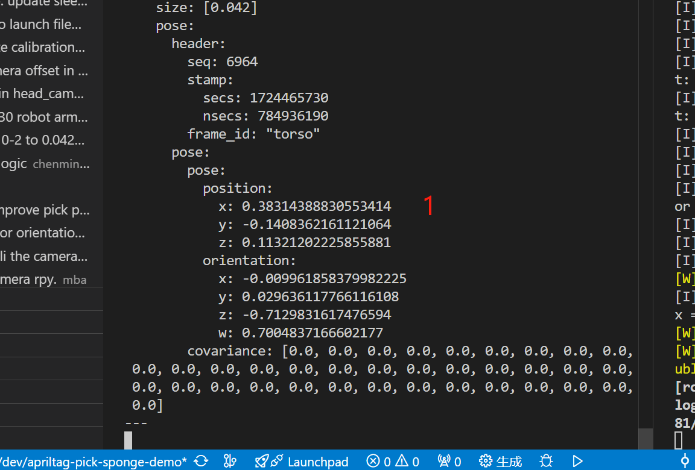
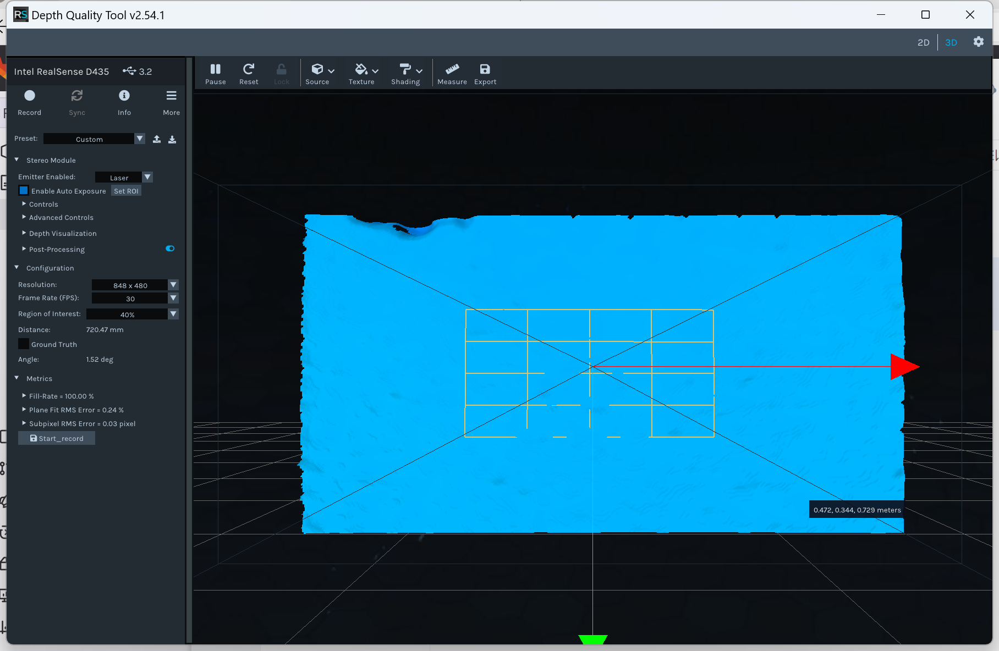

# 开发使用文档

## 配置修改

- 如何调整 kuavo 的 手臂电机速度

- 调整 apriltag 实际大小

- 如何修改抓取的apriltag ID

- 如何调整 moveit 抓取手臂和规划容忍度

- 配置与实物机器人相符合的 URDF 模型

- 如何启用在 rviz 中可视化规划 

#### 调整 kuavo 的 手臂电机速度

如果您的机器人不需要走了修改下位机 kuavo_opensource 仓库中的代码，将下面文件`ros_package/src/main.cc`中的`100`改成`1`：

修改文件`lib/ruiwo_controller/ruiwo_actuator.py`，将下面的`0.01`改成`0.05`，这样会让手臂的电机执行速度更快一些：

```python
velocity_factor = 0.01 # 修改成 0.05 手臂电机执行地快些
```

#### 调整 apriltag 实际大小

用尺测量 apriltag 的实际大小（黑色区域），并修改上位机/下位机的`~/src/ros_vision/detection_apriltag/apriltag_ros/config/tags.yaml`文件，将对应 Id 的大小修改成实际测量得到的 apriltag 大小。

```
    {id: 0, size: 0.042, name: 'tag_0'}, # 修改成实际大小 比如4.2cm 就是0.042
    {id: 1, size: 0.042, name: 'tag_1'}, # 修改成实际大小 比如4.2cm 就是0.042
    {id: 2, size: 0.042, name: 'tag_2'}, # 修改成实际大小 比如4.2cm 就是0.042
    {id: 3, size: 0.04, name: 'tag_3'}, # 修改成实际大小 比如4.0cm 就是0.04
```

#### 配置抓取的apriltag ID

**注意：** apriltag 上有对应的 ID， 请修改文件`src/ros_plan/pick_apriltag_sponge_demo/scripts/pick_apriltag_sponge_demo.py`代码中如下内容与其一致：

```
TAG_ID = 2                  # 检测识别的 AprilTag ID
```

#### 调整 moveit 抓取手臂和规划容忍度

修改`src/ros_plan/pick_apriltag_sponge_demo/config/config.json`文件配置以下内容：

**不建议使用左手抓取，因为我们的案例暂时都是在右手下进行测试的，除非您是开发人员。**

- **用右手抓取**：
  
  - move_group_name 配置为 `"r_arm_group"`
  
  - gripper_name 配置为 `"r_hand_eff"`
  
  - joint_name 配置为 `["r_arm_pitch", "r_arm_roll", "r_arm_yaw", "r_forearm_pitch", "r_hand_yaw", "r_hand_pitch", "r_hand_roll"]`

- 用左手抓取：
  
  - move_group_name 配置为 `"l_arm_group"`
  
  - gripper_name 配置为 `"l_hand_eff"`
  
  - joint_name 配置为 `["l_arm_pitch", "l_arm_roll", "l_arm_yaw", "l_forearm_pitch", "l_hand_yaw", "l_hand_pitch", "l_hand_roll"]`

- 其他参数（根据实际情况修改）：
  
  ```
  "planner_id"                :"RRTstar",      // RRT规划算法
  "num_planning"              :3,              // 一次规划里的重规划次数（3次规划后进行优化，选取方差最小的输出轨迹）
  "planning_time"             :0.2,            // 规划时间 
  "planning_frame"            :"base_link",    // 规划的frame
  
  "max_vel_scaling_factor"    :1,              // 速度缩放因子
  "max_acc_scaling_factor"    :1,              // 加速度缩放因子
  
  "joint_tolerance"           :0.01,            // 关节容忍度（关节误差）单位m -- 目前为1cm
  "orientation_tolerance"     :0.01,            // 姿态容忍度 单位m -- 目前为1cm
  "position_tolerance"        :0.01,            // 位置容忍度 单位m -- 目前为1cm
  
  "publish_rate"              :10,             // 发布速率 
  "gripper_motion_time"       :1               
  ```

### 配置与实物机器人相符合的 URDF 模型

修改文件`src/dynamic_biped/launch/sensor_apriltag_only_enable.launch`中的以下内容：

- 将 `biped_s3`替换为于实物机器人相符合，比如 4 代的 `biped_s4`
- biped_s3 是 4.1 的机器人模型，即白色躯干，头部不可以移动的那代
- biped_s4 银色躯干， 头部能左右上下移动的那代

```xml
 <!-- 机器人全身关节tf树 biped_s4.urdf 发布 -->
    <include file="$(find urdf_tutorial)/launch/display.launch">
        <arg name="model" value="$(find biped_s3)/urdf/biped_s3.urdf" />
    </include>  
```

### 启用在 rviz 中可视化规划

现在抓取海绵块的案例启动时不会在rviz中显示和控制规划，您可以通过修改`src/ros_plan/pick_apriltag_sponge_demo/launch/pick_apriltag_sponge_demo.launch`文件中的如下内容进行启用：

**将`demo_no_rviz.launch`更改为`demo.launch`** 即可。

```xml
<launch>
  <!-- 启动moveit服务器 -->
  <!-- 将 demo_no_rviz.launch 更改为 demo.launch  -->
  <include file="$(find kuavo30_moveit_config)/launch/demo_no_rviz.launch"/>
   <!-- 模式选择 ros 或 cali -->
   <arg name="mode" default="ros"/>
```

## 校准

如你所见，头部的相机相对于水平面是有一定倾斜角度的。虽然相机在 URDF 中的角度是通过 SolidWorks 导出的，在仿真环境中不会存在问题，但是在实物装配或者日益使用的过程中，实际相机的倾斜角度可能会与 URDF 中的不符。因此，我们需要进行标定。

可以将 apriltag 摆放在机器人前面（相机可视范围内），然后运行`rostopic echo /robot_tag_info`或者`rostopic echo /tag_detections`，查看是否有结果输出。

检查识别效果

将打印出来的apriltag A4纸张整齐地放在桌面上。然后执行如下命令，可以看到相机识别输出 tag 的位置信息：

```bash
rostopic echo /robot_tag_info
```

用尺子测量两个 apriltag 的实际距离（如下图，**实际还请重新测量**），然后对比相机检测到的tag位置，查看他们之间的误差（误差不要超过1～2cm），**如果误差过大，那么说明相机或者某些配置不正确了**。



## 常见问题

> 相机标定和输出质量检测工具
> 
> Intel.RealSense.Viewer.exe [下载链接](https://github.com/IntelRealSense/librealsense/releases/download/v2.54.1/Intel.RealSense.Viewer.exe)
> 
> Depth.Quality.Tool.exe [下载链接](https://github.com/IntelRealSense/librealsense/releases/download/v2.54.1/Depth.Quality.Tool.exe)

阅读[D435英特尔深度相机标定文档](https://www.lejuhub.com/ros-application-team/ros_application_group/-/blob/master/Kuavo/D435%20%E8%8B%B1%E7%89%B9%E5%B0%94%E6%B7%B1%E5%BA%A6%E7%9B%B8%E6%9C%BA%E6%A0%87%E5%AE%9A%EF%BC%88%E5%AE%98%E6%96%B9%E5%B7%A5%E5%85%B7%E7%AF%87%EF%BC%89/D435%20%E8%8B%B1%E7%89%B9%E5%B0%94%E6%B7%B1%E5%BA%A6%E7%9B%B8%E6%9C%BA%E6%A0%87%E5%AE%9A%EF%BC%88%E5%AE%98%E6%96%B9%E5%B7%A5%E5%85%B7%E7%AF%87%EF%BC%89.md)，使用 USB 连接线连接相机，将相机对准白墙，在电脑上打开 Depth.Quality.Tool.exe 工具，输出全蓝画面且没有黑点则质量为ok。



## 抓取矿泉水瓶

当您想要通过此案例抓取矿泉水瓶时，您可以进行如下修改：

**修改灵巧手抓取的姿态**

对于抓取瓶子，正着抓的姿态成功概率会更高，建议修改`src/ros_plan/pick_apriltag_sponge_demo/scripts/pick_apriltag_sponge_demo.py`

文件的如下内容：

```python
# 74 行
r_pose2_rpy = [1.5707963/18.0, -1.7007963, 1.5707963/6.0] # 正着垂直抓取
r_catch_poses = [r_pose2_rpy] # 右手抓取姿态
```

**修改 XYZ 的offset**

因为`apriltag`粘贴在瓶盖上，所以灵巧手应该距离瓶盖往下一些才容易抓取！

```bash
X_TO_MOVEIT_OFFSET = -0.000 # X轴偏移量   抓矿泉水瓶 0.000
Y_TO_MOVEIT_OFFSET = 0.000  # Y轴偏移量  抓矿泉水瓶 0.000
Z_TO_MOVEIT_OFFSET = -0.055  # Z轴偏移量 +1.3cm  抓矿泉水瓶 下降5.5cm左右
```

**修改抓取完抬手的高度**

瓶子相比较海绵块高度更高一下，建议抬高更多一些避免打到桌子。

```bash
# 约 342 行
current_pose.pose.position.z += 0.04 # 抓矿泉水瓶时需要抬得更高些 0.06
```
