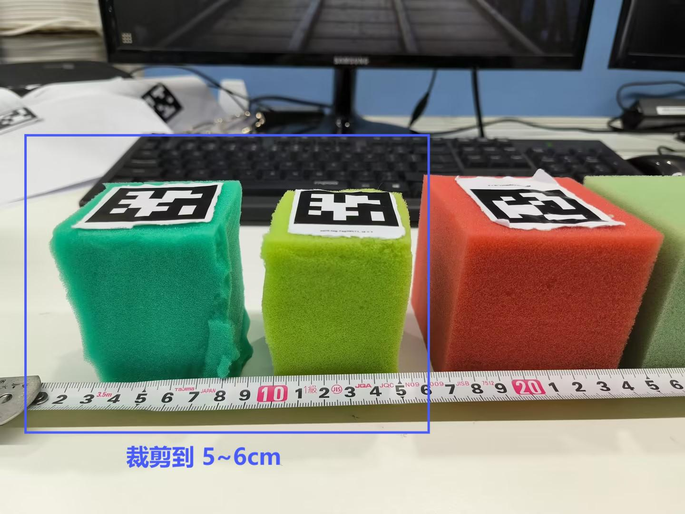
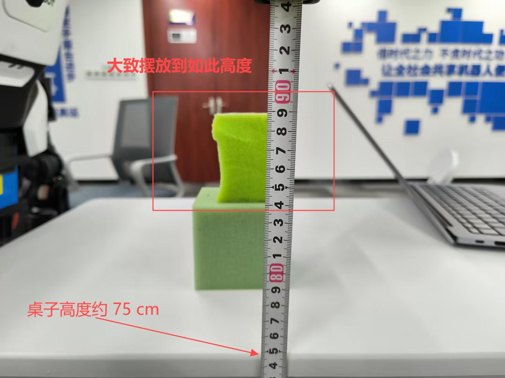

## 物料准备

本案例使用的 Apriltag 图片（ID0～8）已经存放在文件夹`apriltag/`下，**请打印`打印材料-`开头的PDF文件**，打印后可按需裁剪。

**海绵块**

建议准备长宽约 **6cm** 的海绵块，海绵块如果过大可以裁剪到该尺寸。其他尺寸也是可以的，不过抓取的成功率可能没这么高（灵巧手大小有限），目前我们主要在 **6cm** 尺寸下进行测试（7cm 也可以）。

**Apriltag** 

打印文件时请选择A4纸 + **实际大小**进行打印，将 **ID 为 2** 的 Apriltag 裁剪下来使用双面胶粘贴到海绵块的表面。可以多打印一些，因为 apriltag 经过反复抓取捏后，表面可能会褶皱影响识别，此时建议更换重新张贴。apriltag 打印后的大小应该约为 4cm。

**测量纸**

测量纸用于检查相机识别到 tag 位置的误差。

**卷尺或直尺**

建议准备好一把卷尺或直尺用于标定和摆放海绵块到合理的区域。

**桌子**

桌子无特别要求，只要能将海绵块摆放到建议的高度区间内就行，本案例测试时使用到的桌子高度约 75 cm。

**垫高物**

桌子和海绵块的理想摆放高度有一定的差距，建议准备一些垫高物，当然也可以直接使用海绵块进行垫高。

## 摆放建议

如下图所示，机器人站立后，将桌子摆放到前方，并将海绵块摆放到其表面约处于85 cm ～ 90 cm 内。

